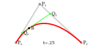
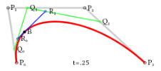
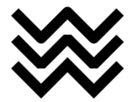
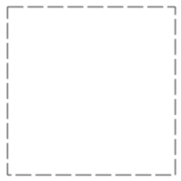

# Canvas

## [参考文档](http://www.runoob.com/w3cnote/html5-canvas-intro.html)

## canvas元素

- 没有Canvas的年代，绘图只能借助Flash插件实现，页面不得不用JavaScript和Flash进行交互。有了Canvas，我们就再也不需要Flash了，直接使用JavaScript完成绘制
- 一个Canvas定义了一个指定尺寸的矩形框，在这个范围内我们可以随意绘制
- Canvas 的默认大小为300px * 150px（宽×高），当没有设置宽度和高度的时候，canvas会初始化宽度为300px和高度为150px
- 由于浏览器对HTML5标准支持不一致，所以，通常在`<canvas>`内部添加一些说明性HTML代码，如果浏览器支持Canvas，它将忽略`<canvas>`内部的 HTML，如果浏览器不支持 Canvas，它将显示`<canvas>`内部的HTML
- （强烈建议不要）该元素可以使用CSS来定义大小，但在绘制时图像会伸缩以适应它的框架尺寸：如果CSS的尺寸与初始画布的比例不一致，它会出现扭曲

```html
<!-- 如果你绘制出来的图像是扭曲的, 尝试用width和height属性为<canvas>明确规定宽高，而不是使用CSS -->
<!-- 可以使用canvas.width = canvas.height = 50; 写法 -->
<canvas id="test-stock" width="300" height="200">
    <p>Current Price: 25.51</p>
</canvas>
```

- `canvas.getContext`可以测试浏览器是否支持Canvas

```js
var canvas = document.getElementById('test-canvas');
if (canvas.getContext) {
    // 创建一个2d上下文环境
    var ctx2d = canvas.getContext('2d');

    // 创建一个3d上下文环境
    var ctx3d = canvas.getContext('webgl');
}
```

## 2d坐标系

- 左上角为原点，水平向右为X轴，垂直向下为Y轴，以像素为单位，所以每个点都是非负整数

## 绘制矩形

- `<canvas>` 只支持一种原生的图形绘制：矩形
  - fillRect(x, y, width, height)：绘制一个填充的矩形
    - 例如： ctx.fillRect(10, 10, 100, 50)
  - strokeRect(x, y, width, height)：绘制一个矩形的边框
  - clearRect(x, y, widh, height)：清除指定的矩形区域，然后这块区域会变的完全透明
- 所有其他图形都至少需要生成一种路径 (path)

## 绘制路径

- 图形的基本元素是路径
- 路径是通过不同颜色和宽度的线段或曲线相连形成的不同形状的点的集合
- 一个路径，甚至一个子路径，都是闭合的
- 步骤
  1. 创建路径起始点
  2. 调用绘制方法去绘制出路径
  3. 把路径封闭
  4. 一旦路径生成，通过描边或填充路径区域来渲染图形
- 绘制函数
  - `beginPath()` 新建一条路径，路径一旦创建成功，图形绘制命令被指向到路径上生成路径
  - `moveTo(x, y)` 把画笔移动到指定的坐标(x, y)。相当于设置路径的起始点坐标
  - `lineTo(x, y)` 绘制一条从当前位置到指定坐标(x, y)的直线
  - `closePath()` 闭合路径之后，图形绘制命令又重新指向到上下文中
  - `stroke()` 通过线条来绘制图形轮廓
  - `fill()` 通过填充路径的内容区域生成实心的图形

## 绘制线段

```js
function draw(){
    var canvas = document.getElementById('tutorial');
    if (!canvas.getContext) return;
    var ctx = canvas.getContext("2d");
    ctx.beginPath(); //新建一条path
    ctx.moveTo(50, 50); //把画笔移动到指定的坐标
    ctx.lineTo(200, 50);  //绘制一条从当前位置到指定坐标(200, 50)的直线.
    //闭合路径。会拉一条从当前点到path起始点的直线。如果当前点与起始点重合，则什么都不做
    ctx.closePath();
    ctx.stroke(); //绘制路径。
}
draw();
```

## 绘制三角形边框

```js
function draw(){
    var canvas = document.getElementById('tutorial');
    if (!canvas.getContext) return;
    var ctx = canvas.getContext("2d");
    ctx.beginPath();
    ctx.moveTo(50, 50);
    ctx.lineTo(200, 50);
    ctx.lineTo(200, 200);
    ctx.closePath(); //虽然我们只绘制了两条线段，但是closePath会closePath，仍然是一个3角形
    ctx.stroke(); //描边。stroke不会自动closePath()
}
draw();
```

## 填充三角形

```js
function draw(){
    var canvas = document.getElementById('tutorial');
    if (!canvas.getContext) return;
    var ctx = canvas.getContext("2d");
    ctx.beginPath();
    ctx.moveTo(50, 50);
    ctx.lineTo(200, 50);
    ctx.lineTo(200, 200);

    ctx.fill(); //填充闭合区域。如果path没有闭合，则fill()会自动闭合路径。
}
draw();
```

## 绘制圆弧

- 第一种方法是使用 `arc(x, y, r, startAngle, endAngle, anticlockwise)`
  - 以(x, y)为圆心，以r为半径，从 startAngle 弧度开始到endAngle 弧度结束。anticlosewise 是布尔值，true表示逆时针，false表示顺时针(默认是顺时针)
  - 这里的度数都是弧度
  - `radians=(Math.PI/180)*degrees`   //角度转换成弧度

```js
function draw(){
    var canvas = document.getElementById('tutorial');
    if (!canvas.getContext) return;
    var ctx = canvas.getContext("2d");
    ctx.beginPath();
    ctx.arc(50, 50, 40, 0, Math.PI / 2, false);
    ctx.stroke();
}
draw();
```

- 第二种方法是 `arcTo(x1, y1, x2, y2, radius)` 根据给定的控制点和半径画一段圆弧
  - 绘制的弧形是由两条切线所决定
    - 第 1 条切线：起始点和控制点1决定的直线
    - 第 2 条切线：控制点1 和控制点2决定的直线
  - 绘制出来的不一定是完美的圆弧
  - 两条直线间半径为radius的圆弧，先去切第一条切线，然后再连接起始点和第一个切点，再沿着第一条直线移动，直到正好切第二条直线位置，但不会补全第二个切点到控制点2的直线，需要在arcTo()方法调用后，手动用lineTo()补全
  

```js
function draw(){
    var canvas = document.getElementById('tutorial');
    if (!canvas.getContext) return;
    var ctx = canvas.getContext("2d");
    ctx.beginPath();
    ctx.moveTo(50, 50);
      //参数1、2：控制点1坐标   参数3、4：控制点2坐标  参数4：圆弧半径
    ctx.arcTo(200, 50, 200, 200, 100);
    // 手动补全第二个切点与控制点2之间的路径
    ctx.lineTo(200, 200)
    ctx.stroke();

    ctx.beginPath();
    ctx.rect(50, 50, 10, 10);
    ctx.rect(200, 50, 10, 10)
    ctx.rect(200, 200, 10, 10)
    ctx.fill()
}
draw();
```

## 绘制贝塞尔曲线

### 一次贝塞尔曲线


### 绘制二次贝塞尔曲线




- quadraticCurveTo(cp1x, cp1y, x, y)
  - 参数 1 和 2：控制点坐标
  - 参数 3 和 4：结束点坐标

```js
function draw(){
    var canvas = document.getElementById('tutorial');
    if (!canvas.getContext) return;
    var ctx = canvas.getContext("2d");
    ctx.beginPath();
    ctx.moveTo(10, 200); //起始点
    //绘制二次贝塞尔曲线
    ctx.quadraticCurveTo(40, 100, 200, 200);
    ctx.stroke();
}
draw();
```

### 绘制三次贝塞尔曲线




- bezierCurveTo(cp1x, cp1y, cp2x, cp2y, x, y)
  - 参数 1 和 2：控制点 1 的坐标
  - 参数 3 和 4：控制点 2 的坐标
  - 参数 5 和 6：结束点的坐标

```js
function draw(){
    var canvas = document.getElementById('tutorial');
    if (!canvas.getContext) return;
    var ctx = canvas.getContext("2d");
    ctx.beginPath();
    ctx.moveTo(40, 200); // 起始点
    // 绘制二次贝塞尔曲线
    ctx.bezierCurveTo(20, 100, 100, 120, 200, 200);
    ctx.stroke();
}
draw();
```

## 添加样式和颜色

- `fillStyle` 设置图形的填充颜色。`strokeStyle` 设置图形轮廓的颜色
  - `color` 可以是表示 css 颜色值的字符串、渐变对象或者图案对象
  - 默认情况下，线条和填充颜色都是黑色
  - 一旦您设置了 strokeStyle 或者 fillStyle 的值，那么这个新值就会成为新绘制的图形的默认值。如果你要给每个图形上不同的颜色，你需要重新设置 fillStyle 或 strokeStyle 的值

```js
// fillStyle
function draw(){
  var canvas = document.getElementById('tutorial');
  if (!canvas.getContext) return;
  var ctx = canvas.getContext("2d");
  for (var i = 0; i < 6; i++){
    for (var j = 0; j < 6; j++){
      ctx.fillStyle = 'rgb(' + Math.floor(255 - 42.5 * i) + ',' +
        Math.floor(255 - 42.5 * j) + ',0)';
      ctx.fillRect(j * 50, i * 50, 50, 50);
    }
  }
}
draw();

// strokeStyle
function draw(){
    var canvas = document.getElementById('tutorial');
    if (!canvas.getContext) return;
    var ctx = canvas.getContext("2d");
    for (var i = 0; i < 6; i++){
        for (var j = 0; j < 6; j++){
            ctx.strokeStyle = `rgb(${randomInt(0, 255)},${randomInt(0, 255)},${randomInt(0, 255)})`;
            ctx.strokeRect(j * 50, i * 50, 40, 40);
        }
    }
}
draw();
/**
 返回随机的 [from, to] 之间的整数(包括from，也包括to)
 */
function randomInt(from, to){
    return parseInt(Math.random() * (to - from + 1) + from);
}
```

## globalAlpha 透明度

- 这个属性影响到 canvas 里所有图形的透明度，有效的值范围是 0.0 （完全透明）到 1.0（完全不透明），默认是 1.0
- ​globalAlpha 属性在需要绘制大量拥有相同透明度的图形时候相当高效
  - 使用rgba()设置透明度更加好一些

## 绘制线

### lineWidth 线宽

- 只能是正值。默认是 1.0
- 起始点和终点的连线为中心，上下各占线宽的一半

```js
ctx.beginPath();
ctx.moveTo(10, 10);
ctx.lineTo(100, 10);
ctx.lineWidth = 10;
ctx.stroke();
```

### lineCap 线条末端样式


- `butt`：线段末端以方形结束
- `round`：线段末端以圆形结束
- `square`：线段末端以方形结束，但是增加了一个宽度和线段相同，高度是线段厚度一半的矩形区域

```js
var lineCaps = ["butt", "round", "square"];
for (var i = 0; i < 3; i++){
    ctx.beginPath();
    ctx.moveTo(20 + 30 * i, 30);
    ctx.lineTo(20 + 30 * i, 100);
    ctx.lineWidth = 20;
    ctx.lineCap = lineCaps[i];
    ctx.stroke();
}
```

### lineJoin 同一个 path 内，设定线条与线条间接合处的样式



- `round` 通过填充一个额外的，圆心在相连部分末端的扇形，绘制拐角的形状。 圆角的半径是线段的宽度
- `bevel` 在相连部分的末端填充一个额外的以三角形为底的区域， 每个部分都有各自独立的矩形拐角
- `miter`(默认) 通过延伸相连部分的外边缘，使其相交于一点，形成一个额外的菱形区域

```js
function draw(){
    var canvas = document.getElementById('tutorial');
    if (!canvas.getContext) return;
    var ctx = canvas.getContext("2d");

    var lineJoin = ['round', 'bevel', 'miter'];
    ctx.lineWidth = 20;

    for (var i = 0; i < lineJoin.length; i++){
        ctx.lineJoin = lineJoin[i];
        ctx.beginPath();
        ctx.moveTo(50, 50 + i * 50);
        ctx.lineTo(100, 100 + i * 50);
        ctx.lineTo(150, 50 + i * 50);
        ctx.lineTo(200, 100 + i * 50);
        ctx.lineTo(250, 50 + i * 50);
        ctx.stroke();
    }
}
draw();
```

### miterLimit 设置或返回线段最大斜接长度

- 当 lineJoin 是 miter 斜接时，可以通过 miterLimit 设置最大斜接长度，如果实际斜接长度超过 miterLimit 的值，边角会以 lineJoin 的 "bevel" 类型来显示

### 虚线



- setLineDash 方法接受一个数组，来指定线段与间隙的交替
- lineDashOffset属性设置起始偏移量，逆时针方向

```js
function draw(){
    var canvas = document.getElementById('tutorial');
    if (!canvas.getContext) return;
    var ctx = canvas.getContext("2d");

    ctx.setLineDash([20, 5]);  // [实线长度, 间隙长度]
    ctx.lineDashOffset = -0;
    ctx.strokeRect(50, 50, 210, 210);
}
draw();
```

- ctx.getLineDash() 返回 setLineDash() 中设置的数组

## 绘制文本内容

- 两种方法
  - `fillText(text, x, y [, maxWidth])` 在指定的 (x,y) 位置填充指定的文本，绘制的最大宽度是可选的
  - `strokeText(text, x, y [, maxWidth])` 在指定的 (x,y) 位置绘制文本边框，绘制的最大宽度是可选的
  - y坐标是指文字的baseline位置

```js
var ctx;
function draw(){
    var canvas = document.getElementById('tutorial');
    if (!canvas.getContext) return;
    ctx = canvas.getContext("2d");
    ctx.shadowOffsetX = 2;
    ctx.shadowOffsetY = 2;
    ctx.shadowBlur = 2;
    ctx.shadowColor = '#666666';
    ctx.font = '24px Arial';
    ctx.fillStyle = '#333333';
    ctx.fillText("天若有情", 10, 100);
    ctx.strokeText("天若有情", 10, 200);
}
draw();
```

- 测量文本的宽度
  - ctx.measureText(text).width： 返回text文本的宽度，单位为px（但返回值不带px）
  
  ```js
  var c=document.getElementById("myCanvas");
  var ctx=c.getContext("2d");
  ctx.font="30px Arial";
  var txt="Hello World"
  ctx.fillText("width:" + ctx.measureText(txt).width,10,50)
  ctx.fillText(txt,10,100);
  ```

- 设置文本样式
  - `font` 当前我们用来绘制文本的样式。这个字符串使用和 CSS font 属性相同的语法。 默认的字体是 10px sans-serif
  - `textAlign` 文本对齐选项。 可选的值包括：start, end, left, right or center。 默认值是 start
  - `textBaseline` 基线对齐选项，可选的值包括：top, hanging, middle, alphabetic, ideographic, bottom。默认值是 alphabetic
  - `direction` 文本方向。可能的值包括：ltr (文本方向从左向右), rtl (文本方向从右向左), inherit。默认值是 inherit
  - `shadowOffsetX` 形状阴影在水平轴的偏移方向和距离，值大于0为向右，小于0为向左，等于0为正下方
  - `shadowOffsetY` 形状阴影在垂直轴的偏移方向和距离，值大于0为向下，小于0为向上，等于0为正下方
  - `shadowBlur` 形状阴影的模糊值，小于0无效
  - `shadowColor` 阴影的颜色

## 绘制图像

- createImageData(width,height) 创建新的、空白的 ImageData 对象(宽高以px计)，新对象的默认像素值 transparent black，即(0,0,0,0)
- 对于 ImageData 对象中的每个像素，都存在着四方面的信息，即 RGBA 值：
  - R - 红色 (0-255)
  - G - 绿色 (0-255)
  - B - 蓝色 (0-255)
  - A - alpha 通道 (0-255; 0 是透明的，255 是完全可见的)
- color/alpha 以数组形式存在，该一维数组由每个像素的四条信息合并组成，数组的长度是 ImageData 对象的四倍，可以通过 ImageData.data.length 方式获取
- 包含 color/alpha 信息的数组存储于 ImageData 对象的 data 属性中
- ImageData 对象的 width 和 height 属性返回 宽和高
- 在操作完成数组中的 color/alpha 信息之后，您可以使用 putImageData(imgData, x, y) 方法将图像数据拷贝回画布上

```js
var c=document.getElementById("myCanvas");
var ctx=c.getContext("2d");
var imgData=ctx.createImageData(100,100);
for (var i=0;i<imgData.data.length;i+=4){
  imgData.data[i+0]=255;
  imgData.data[i+1]=0;
  imgData.data[i+2]=0;
  imgData.data[i+3]=255;
}
ctx.putImageData(imgData,10,10);
// 创建与指定的另一个 ImageData 对象尺寸相同的新 ImageData 对象（不会复制图像数据,即只复制宽高）
var imgData2=context.createImageData(imageData);
```

## 渐变样式

- createLinearGradient(x0,y0,x1,y1) 创建线性的 gradient 渐变对象
  - 渐变可用于填充矩形、圆形、线条、文本等等
  - gradient 对象作为 strokeStyle 或 fillStyle 属性的值
  - 使用 addColorStop() 方法规定不同的颜色，以及在 gradient 对象中的何处定位颜色
    - gradient.addColorStop(stop,color) 可多次调用来改变渐变
      - stop：取值（0 ~ 1），表示渐变中开始与结束之间的位置，即在渐变区域内开始时的百分比位置和结束时的百分比位置
      - color: 在结束位置显示的 CSS 颜色值
    - 如果不对 gradient 对象使用该方法，那么渐变将不可见

```js
var c=document.getElementById("myCanvas");
var ctx=c.getContext("2d");

var grd=ctx.createLinearGradient(0,0,170,0);
grd.addColorStop(0,"black");
grd.addColorStop("0.3","magenta");
grd.addColorStop("0.5","blue");
grd.addColorStop("0.6","green");
grd.addColorStop("0.8","yellow");
grd.addColorStop(1,"red");

ctx.fillStyle=grd;
ctx.fillRect(20,20,150,100);
```

- createRadialGradient(x0,y0,r0,x1,y1,r1) 用法与线性渐变一致，本质是个环状区域,可以用来绘制内外圆不同颜色的图形
  - x0：渐变的开始圆的 x 坐标
  - y0：渐变的开始圆的 y 坐标
  - r0：开始圆的半径
  - x1：渐变的结束圆的 x 坐标
  - y1：渐变的结束圆的 y 坐标
  - r1：结束圆的半径

```js
var c=document.getElementById("myCanvas");
var ctx=c.getContext("2d");

var grd=ctx.createRadialGradient(75,50,5,90,60,100);
grd.addColorStop(0,"red");
grd.addColorStop(1,"white");

ctx.fillStyle=grd;
ctx.fillRect(10,10,150,100);
```

- context.createPattern(image,"repeat|repeat-x|repeat-y|no-repeat")
  - 在指定方向上重复指定的元素
  - 该对象作为 fillStyle 的值
  - image: 规定要使用的图片、画布或视频元素
  - repeat: 默认。该模式在水平和垂直方向重复
  - repeat-x: 该模式只在水平方向重复
  - repeat-y: 该模式只在垂直方向重复
  - no-repeat: 该模式只显示一次（不重复）

```js
var c=document.getElementById("myCanvas");
var ctx=c.getContext("2d");
var img=document.getElementById("lamp");
var pat=ctx.createPattern(img,"repeat");
ctx.rect(0,0,150,100);
ctx.fillStyle=pat;
ctx.fillRect(0,0,150,100);
```

## 绘制图片

- `drawImage(image, sx, sy, sWidth, sHeight, dx, dy, dWidth, dHeight)`
  - 参数 1：要绘制的 img 或者另一个 canvas 的引用
  - `sx, sy, sWidth, sHeight` 是定义图像源的切片位置和大小，`dx, dy, dWidth, dHeight` 则是定义切片的目标显示位置和大小
    - ctx.drawImage(img, 0, 0, 400, 200, 10, 10, 200, 100)

```js
// 考虑到图片是从网络加载，如果 drawImage 的时候图片还没有完全加载完成，则什么都不做，个别浏览器会抛异常。所以我们应该保证在 img 绘制完成之后再 drawImage
var img = new Image();   // 创建img元素
img.onload = function(){
    ctx.drawImage(img, 0, 0)
}
img.src = 'myImage.png'; // 设置图片源地址

// img 可以 new 也可以来源于我们页面的 标签
<br>
<canvas id="tutorial" width="600" height="400"></canvas>
function draw(){
    var canvas = document.getElementById('tutorial');
    if (!canvas.getContext) return;
    var ctx = canvas.getContext("2d");
    var img = document.querySelector("img");
    ctx.drawImage(img, 0, 0);
}
document.querySelector("img").onclick = function (){
    draw();
}
```

## 状态的保存和恢复

- Canvas 的状态就是当前画面应用的所有样式和变形的一个快照
- `save()` 和 `restore()` 方法是用来保存和恢复 canvas 状态的，都没有参数
- `save()` ：Canvas状态存储在栈中，每当save()方法被调用后，当前的状态就被推送到栈中保存
  - 一个绘画状态包括：
    - 当前应用的变形（即移动，旋转和缩放）
    - strokeStyle, fillStyle, globalAlpha, lineWidth, lineCap, lineJoin, miterLimit, shadowOffsetX, shadowOffsetY, shadowBlur, shadowColor, globalCompositeOperation 的值
    - 当前的裁切路径（clipping path）
  - 可以调用任意多次 save方法(类似数组的 push())
- `restore()`：每一次调用 restore 方法，上一个保存的状态就从栈中弹出，所有设定都恢复(类似数组的 pop())

```js
var ctx;
function draw(){
    var canvas = document.getElementById('tutorial');
    if (!canvas.getContext) return;
    var ctx = canvas.getContext("2d");

    ctx.fillRect(0, 0, 150, 150);   // 使用默认设置绘制一个矩形, 默认黑色填充
    ctx.save();                  // 保存默认状态

    ctx.fillStyle = 'red'       // 在原有配置基础上对颜色做改变
    ctx.fillRect(15, 15, 120, 120); // 使用新的设置绘制一个矩形

    ctx.save();                  // 保存当前状态
    ctx.fillStyle = '#FFF'       // 再次改变颜色配置
    ctx.fillRect(30, 30, 90, 90);   // 使用新的配置绘制一个矩形

    ctx.restore();               // 重新加载之前的red颜色状态
    ctx.fillRect(45, 45, 60, 60);   // 使用上一次的配置绘制一个矩形

    ctx.restore();               // 加载默认黑色颜色配置
    ctx.fillRect(60, 60, 30, 30);   // 使用加载的配置绘制一个矩形
}
draw();
```

## 变形

### translate(x, y)

- 用来移动 canvas 的原点到指定的位置。  注意：translate 移动的是 canvas 的坐标原点(坐标变换)
- 在做变形之前先保存状态是一个良好的习惯。大多数情况下，调用 restore 方法比手动恢复原先的状态要简单得多。
- 如果你是在一个循环中做位移但没有保存和恢复 canvas 的状态，很可能到最后会发现怎么有些东西不见了，那是因为它很可能已经超出 canvas 范围以外了

```js
var ctx;
function draw(){
    var canvas = document.getElementById('tutorial1');
    if (!canvas.getContext) return;
    var ctx = canvas.getContext("2d");
    // 在translate之前画好的不受影响
    ctx.strokeRect(0, 0, 100, 100)
    ctx.save(); //保存坐原点平移之前的状态
    ctx.translate(100, 100);
    ctx.strokeRect(0, 0, 100, 100)
    ctx.restore(); //恢复到最初状态
    ctx.translate(220, 220);
    ctx.fillRect(0, 0, 100, 100)
}
draw();
```

### rotate(angle)

- 旋转坐标轴
- 旋转的角度(angle)，它是顺时针方向的，以弧度为单位的值
- 旋转的中心是坐标原点

```js
var ctx;
function draw(){
  var canvas = document.getElementById('tutorial1');
  if (!canvas.getContext) return;
  var ctx = canvas.getContext("2d");

  ctx.fillStyle = "red";
  ctx.save();

  ctx.translate(100, 100);
  ctx.rotate(Math.PI / 180 * 45);
  ctx.fillStyle = "blue";
  ctx.fillRect(0, 0, 100, 100);
  ctx.restore();

  ctx.save();
  ctx.fillRect(0, 0, 50, 50)
  ctx.restore();
}
draw();
```

### scale(x, y)

- 增减图形在 canvas 中的像素数目，对形状，位图进行缩小或者放大
- x,y 分别是横轴和纵轴的缩放因子，它们都必须是正值。值比 1.0 小表示缩 小，比 1.0 大则表示放大，值为 1.0 时什么效果都没有
- 默认情况下，canvas 的 1 单位就是 1 个像素

### transform(a, b, c, d, e, f) (变形矩阵) ？？？？

- a (m11): 水平缩放绘图
- b (m12): 水平倾斜绘图
- c (m21):​ 垂直倾斜绘图
- d (m22):​ 垂直缩放绘图
- e (dx):​ 水平移动绘图
- f (dy):​ 垂直移动绘图

```js
 a c e
 b d f
 0 0 1
```

```js
var ctx;
function draw(){
    var canvas = document.getElementById('tutorial1');
    if (!canvas.getContext) return;
    var ctx = canvas.getContext("2d");
    ctx.transform(1, 1, 0, 1, 0, 0);
    ctx.fillRect(0, 0, 100, 100);
}
draw();
```

- 每当调用 transform() 时，它都会在前一个变换矩阵上构建
- transform() 方法的行为相对于由 rotate(), scale(), translate(), or transform() 完成的其他变换。例如：如果已经将绘图设置为放到两倍，则 transform() 方法会把绘图放大两倍，绘图最终将放大四倍

### setTransform(a, b, c, d, e, f)

- setTransform() 与 transform() 基本相同
- setTransform() 重置并创建新的变换矩阵，不会在前一个变换矩阵上构建

### 合成 globalCompositeOperation

```js
var ctx;
function draw(){
    var canvas = document.getElementById('tutorial1');
    if (!canvas.getContext) return;
    var ctx = canvas.getContext("2d");

    ctx.fillStyle = "blue";
    ctx.fillRect(0, 0, 200, 200);

    ctx.globalCompositeOperation = "source-over"; //全局合成操作
    ctx.fillStyle = "red";
    ctx.fillRect(100, 100, 200, 200);
}
draw();
```

- 默认设置：新图像会覆盖在原有图像
- 13种设置值（source可以当做新图像，destination当做原图像）
- `source-in`：仅会出现新图像与原来图像重叠的部分，其他区域都变成透明的。(包括其他的老图像区域也会透明)
- `source-out`: 仅显示新图像与老图像没有重叠的部分，其余部分全部透明。(老图像也不显示)
- `source-atop`: 新图像仅仅显示与老图像重叠区域。老图像仍然可以显示
- `destination-over`: 新图像会在老图像的下面
- `destination-in`：仅新老图像重叠部分的老图像被显示，其他区域全部透明
- `destination-out`: 仅老图像与新图像没有重叠的部分。 注意显示的是老图像的部分区域
- `destination-atop`: 老图像仅显示重叠部分，新图像会显示在老图像的下面
- `lighter`: 新老图像都显示，但是重叠区域的颜色做加处理
- `darken`: 保留重叠部分最黑的像素。(每个颜色位进行比较，得到最小的)
  - `blue: #0000ff` 和 `red: #ff0000` , 所以重叠部分的颜色为：`#000000`
- `lighten`: 保证重叠部分最亮的颜色。(每个颜色位进行比较，得到最大的)
  - `blue: #0000ff` 和 `red: #ff0000` 所以重叠部分的颜色为 `#ff00ff`
- `xor`: 重叠部分会变成透明
- `copy`: 只有新图像会被保留，其余的全部被清除(变透明)

## 裁剪路径 clip()

- 把已经创建的路径转换成裁剪路径
- 从画布中剪切一个区域，进而对这个剪切出来的区域进行绘制，那么只有被剪切区域内的部分是可见的
- 可以在clip() 之前 save() 保存下原始状态

```js
var ctx;
function draw(){
    var canvas = document.getElementById('tutorial1');
    if (!canvas.getContext) return;
    var ctx = canvas.getContext("2d");

    ctx.beginPath();
    ctx.arc(20, 20, 100, 0, Math.PI * 2); // 只有这个范围内绘制的canvas能看到
    ctx.clip();
    // 在 clip() 之后绘制矩形
    ctx.fillStyle = "pink";
    ctx.fillRect(20, 20, 100,100);
}
draw();
```

## isPointInPath()

- 如果指定的点位于当前路径中，则返回 true，否则返回 false

```js
var c=document.getElementById("myCanvas");
var ctx=c.getContext("2d");
ctx.rect(20,20,150,100);
if (ctx.isPointInPath(20,50)){
   ctx.stroke();
};
```

## 动画

- 基本步骤
  - 清空 canvas：在绘制每一帧动画之前，需要清空所有。清空所有最简单的做法就是 clearRect() 方法
  - 保存 canvas 状态 如果在绘制的过程中会更改 canvas 的状态(颜色、移动了坐标原点等),又在绘制每一帧时都是原始状态的话，则最好保存下 canvas 的状态
  - 绘制动画图形这一步才是真正的绘制动画帧
  - 恢复 canvas 状态如果你前面保存了 canvas 状态，则应该在绘制完成一帧之后恢复 canvas 状态
- 控制动画
  - 通过 canvas 的方法或者自定义的方法把图像绘制到 canvas 上
  - 正常情况，我们能看到绘制的结果是在脚本执行结束之后。例如，我们不可能在一个 for 循环内部完成动画
  - 为了执行动画，我们需要一些可以定时执行重绘的方法
    - setInterval()
    - setTimeout()
    - `requestAnimationFrame()`
      - setTimeout和setInterval的问题是，它们都不精确。它们的内在运行机制决定了时间间隔参数实际上只是指定了把动画代码添加到浏览器UI线程队列中以等待执行的时间。如果队列前面已经加入了其他任务，那动画代码就要等前面的任务完成后再执行
      - requestAnimationFrame会把每一帧中的所有DOM操作集中起来，在一次重绘或回流中就完成，并且重绘或回流的时间间隔紧紧跟随浏览器的刷新频率
      - 在隐藏或不可见的元素中，requestAnimationFrame将不会进行重绘或回流，这当然就意味着更少的CPU、GPU和内存使用量
      - requestAnimationFrame是由浏览器专门为动画提供的API，在运行时浏览器会自动优化方法的调用，并且如果页面不是激活状态下的话，动画会自动暂停，有效节省了CPU开销
      - requestAnimationFrame的用法与settimeout很相似，只是不需要设置时间间隔而已
      - requestAnimationFrame使用一个回调函数作为参数，这个回调函数会在浏览器重绘之前调用。它返回一个整数，表示定时器的编号，这个值可以传递给cancelAnimationFrame用于取消这个函数的执行
      - 回调函数有一个参数，是一个相对的时间毫秒值，表示当前的刷新时间

      ```js
      window.requestAnimationFrame(function(time){
          //显示频刷新的时候被执行
      })；
      ```

      - 兼容写法

      ```js
        if(!window.requestAnimationFrame){
            var lastTime = 0;
            window.requestAnimationFrame = function(callback){
                var currTime = new Date().getTime();
                var timeToCall = Math.max(0,16.67-(currTime - lastTime));
                var id  = window.setTimeout(function(){
                    callback(currTime + timeToCall);
                },timeToCall);
                lastTime = currTime + timeToCall;
                return id;
            }
        }

        if (!window.cancelAnimationFrame) {
            window.cancelAnimationFrame = function(id) {
                clearTimeout(id);
            };
        }

        var timer;
        btn.onclick = function(){
            myDiv.style.width = '0';
            cancelAnimationFrame(timer);
            timer = requestAnimationFrame(function fn(){
                if(parseInt(myDiv.style.width) < 500){
                    myDiv.style.width = parseInt(myDiv.style.width) + 5 + 'px';
                    myDiv.innerHTML = parseInt(myDiv.style.width)/5 + '%';
                    timer = requestAnimationFrame(fn);
                }else{
                    cancelAnimationFrame(timer);
                }
            });
        }
      ```

      - requestAnimationFrame 不管理回调函数队列，而滚动、触摸这类高触发频率事件的回调可能会在同一帧内触发多次, 所以在同一帧内可能调用多次 requestAnimationFrame 时，要管理回调函数，防止重复绘制动画
        - 一般的解决方法是使用节流函数。但是在这里使用节流函数并不能完美解决问题。因为节流函数是通过时间管理队列的，而 requestAnimationFrame 的触发时间是不固定的，在高刷新频率的显示屏上时间会小于 16.67ms，页面如果被推入后台，时间可能大于 16.67ms, 完美的解决方法是通过 requestAnimationFrame 来管理队列

      ```js
        // 原理示意
        const onScroll = e => {
            if (scheduledAnimationFrame) { return }

            scheduledAnimationFrame = true
            window.requestAnimationFrame(timestamp => {
                scheduledAnimationFrame = false
                animation(timestamp)
            })
        }
        window.addEventListener('scroll', onScroll)
      ```

      ```js
        // 正式解决方案
        const callbackList = []

        function raf(callback) {
            const entry = callbackList.find(item => item.callback === callback)
            if (entry) {
                return entry.requestId
            }
            else {
                const requestId = requestAnimationFrame(ts => {
                    const index = callbackList.findIndex(item => item.callback === callback)
                    callbackList.splice(index, 1)
                    callback(ts)
                })
                callbackList.push({
                    callback,
                    requestId,
                })
                return requestId
            }
        }
        function caf(requestId) {
            const index = callbackList.findIndex(item => item.requestId === requestId);
            if (~index) {
                callbackList.splice(index, 1)
            }
            cancelAnimationFrame(requestId)
        }

        export {
            raf as requestAnimationFrame,
            caf as cancelAnimationFrame,
        }
      ```

### 太阳系动画案例

```js
let sun;
let earth;
let moon;
let ctx;
function init(){
    sun = new Image();
    earth = new Image();
    moon = new Image();
    sun.src = "sun.png";
    earth.src = "earth.png";
    moon.src = "moon.png";

    let canvas = document.querySelector("#solar");
    ctx = canvas.getContext("2d");
    // 图片加载后开始绘制
    sun.onload = function (){
        draw()
    }

}
init();
function draw(){
    ctx.clearRect(0, 0, 300, 300); //每次绘制前清空所有的内容
    /*绘制 太阳*/
    ctx.drawImage(sun, 0, 0, 300, 300);

    ctx.save();
    // 将canvas坐标系原点移至太阳中心点
    ctx.translate(150, 150);

    //绘制earth轨道
    ctx.beginPath();
    ctx.strokeStyle = "rgba(255,255,0,0.5)";
    ctx.arc(0, 0, 100, 0, 2 * Math.PI)
    ctx.stroke()

    let time = new Date();
    //绘制地球
    ctx.rotate(2 * Math.PI / 60 * time.getSeconds() + 2 * Math.PI / 60000 * time.getMilliseconds())
    // 将canvas坐标系原点移至地球中心点
    ctx.translate(100, 0);
    // 12为地球的半径
    ctx.drawImage(earth, -12, -12)

    //绘制月球轨道
    ctx.beginPath();
    ctx.strokeStyle = "rgba(255,255,255,.3)";
    ctx.arc(0, 0, 40, 0, 2 * Math.PI);
    ctx.stroke();

    //绘制月球
    ctx.rotate(2 * Math.PI / 6 * time.getSeconds() + 2 * Math.PI / 6000 * time.getMilliseconds());
    // 将canvas坐标系原点移至月球中心点
    ctx.translate(40, 0);
    // 3.5为月球的半径
    ctx.drawImage(moon, -3.5, -3.5);
    ctx.restore();

    requestAnimationFrame(draw);
}
```

### 时钟动画案例

```js
init();

function init(){
    let canvas = document.querySelector("#solar");
    let ctx = canvas.getContext("2d");
    draw(ctx);
}

function draw(ctx){
    requestAnimationFrame(function step(){
        drawDial(ctx); //绘制表盘
        drawAllHands(ctx); //绘制时分秒针
        requestAnimationFrame(step);
    });
}
/*绘制时分秒针*/
function drawAllHands(ctx){
    let time = new Date();

    let s = time.getSeconds();
    let m = time.getMinutes();
    let h = time.getHours();

    let pi = Math.PI;
    let secondAngle = pi / 180 * 6 * s;  //计算出来s针的弧度
    let minuteAngle = pi / 180 * 6 * m + secondAngle / 60;  //计算出来分针的弧度
    let hourAngle = pi / 180 * 30 * h + minuteAngle / 12;  //计算出来时针的弧度

    drawHand(hourAngle, 60, 6, "red", ctx);  //绘制时针
    drawHand(minuteAngle, 106, 4, "green", ctx);  //绘制分针
    drawHand(secondAngle, 129, 2, "blue", ctx);  //绘制秒针
}
/*绘制时针、或分针、或秒针
 * 参数1：要绘制的针的角度
 * 参数2：要绘制的针的长度
 * 参数3：要绘制的针的宽度
 * 参数4：要绘制的针的颜色
 * 参数4：ctx
 * */
function drawHand(angle, len, width, color, ctx){
    ctx.save();
    ctx.translate(150, 150); //把坐标轴的远点平移到原来的中心
    ctx.rotate(-Math.PI / 2 + angle);  //旋转坐标轴。 x轴就是针的角度
    ctx.beginPath();
    ctx.moveTo(-4, 0);
    ctx.lineTo(len, 0);  // 沿着x轴绘制针
    ctx.lineWidth = width;
    ctx.strokeStyle = color;
    ctx.lineCap = "round";
    ctx.stroke();
    ctx.closePath();
    ctx.restore();
}

/*绘制表盘*/
function drawDial(ctx){
    let pi = Math.PI;

    ctx.clearRect(0, 0, 300, 300); //清除所有内容
    ctx.save();

    ctx.translate(150, 150); //一定坐标原点到原来的中心
    ctx.beginPath();
    ctx.arc(0, 0, 148, 0, 2 * pi); //绘制圆周
    ctx.stroke();
    ctx.closePath();

    for (let i = 0; i < 60; i++){//绘制刻度。
        ctx.save();
        ctx.rotate(-pi / 2 + i * pi / 30);  //旋转坐标轴。坐标轴x的正方形从 向上开始算起
        ctx.beginPath();
        ctx.moveTo(110, 0);
        ctx.lineTo(140, 0);
        ctx.lineWidth = i % 5 ? 2 : 4;
        ctx.strokeStyle = i % 5 ? "blue" : "red";
        ctx.stroke();
        ctx.closePath();
        ctx.restore();
    }
    ctx.restore();
}
```

### 高级操作优化方案

- Canvas除了能绘制基本的形状和文本，还可以实现动画、缩放、各种滤镜和像素转换等高级操作。如果要实现非常复杂的操作，考虑以下优化方案：
  - 通过创建一个不可见的Canvas来绘图，然后将最终绘制结果复制到页面的可见Canvas中
  - 尽量使用整数坐标而不是浮点数
  - 可以创建多个重叠的Canvas绘制不同的层，而不是在一个Canvas中绘制非常复杂的图
  - 背景图片如果不变可以直接用``标签并放到最底层
