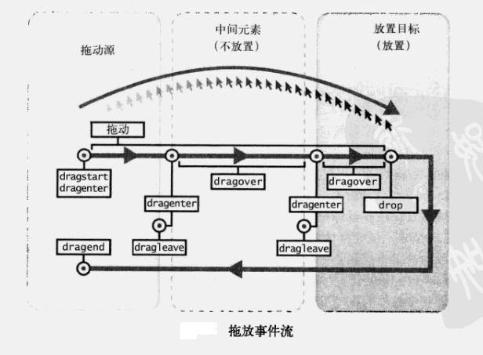

# html5

## MDN地址

- [参考文档](https://developer.mozilla.org/zh-CN/docs/Web/API/HTML_Drag_and_Drop_API)

## 拖放 drag

### 拖拽事件



- drag: 当拖动元素或选中的文本时触发
- dragstart: 当用户开始拖动一个元素或选中的文本时触发
- dragenter: 当拖动元素或选中的文本到一个可释放目标时触发
- dragend: 当拖拽操作结束时触发 (比如松开鼠标按键或敲“Esc”键)，即使drag取消了依旧触发
  - 触发此事件时event的 screenX 和 screenY 属性就是 发生 drop 事件的对象的坐标
- dragexit: 当元素变得不再是拖动操作的选中目标时触发
- dragleave: 当拖动元素或选中的文本离开一个可释放目标时触发, 即使drag取消了依旧触发
- dragover: 当元素或选中的文本被拖到一个可释放目标上时触发（每100ms触发一次）
- drop: 当元素或选中的文本在可释放目标上被释放时触发
- 注意当从操作系统向浏览器中拖动文件时，不会触发 dragstart 和 dragend 事件

### 接口

- `DragEvent` 接口有一个构造函数和一个dataTransfer属性
- `dataTransfer`属性是一个DataTransfer对象
  - setData(format,data):在dragstart事件中调用此函数可以注册一个MIME类型格式的传输项
  - clearData():不带参则清空所有注册数据，带参则移除指定注册项
  - getData(format):可以获取指定类型的注册数据项
  - types：以数组形式返回所有当前注册的格式
  - items：返回所有项机器相关格式列表
  - files：返回与放置相关的所有文件
    - files属性用到了 File API 规范的子集，files存放了文件列表
    - files支持下列属性
      - name:带有扩展名的文件全名
      - type：文件的MIME类型
      - size：以字节为单位的文件大小
      - lastModifiedDate：最后一次修改文件内容的时间戳
    - 使用files属性时常会涉及到 [FileReader 对象](https://developer.mozilla.org/zh-CN/docs/Web/API/FileReader) 读取文件
  - 其他一些属性
- DragEvent 和 DataTransfer 是可以给应用程序添加html拖放功能的仅有的接口
- firefox 给 DataTransfer 添加了可能用到的一些扩展的功能 `DataTransferItem` 接口和 `DataTransferItemList` 接口
  - 每个 DataTransfer  包含一个items属性，这个属性是一个 DataTransferItem 对象的列表
  - 每一个 DataTransfer 对象代表一个单独的拖动项，每一项有个 kind 属性和 type 属性
    - kind: 代表数据的格式（string | file）
    - type：代表数据的类型 （例如 MIME）
  - DataTransferItem 对象也包含了得到拖拽项的数据的方法
  - DataTransferItemList 对象是 DataTransferItem 对象的列表。这个列表对象包含以下方法：向列表中添加拖动项，从列表中移除拖动项和清空列表中所有的拖拽项
  - DataTransfer 和DataTransferItem 接口的一个主要的不同在于，前者使用同步的 getData() 方法去得到一个拖拽项的数据，然后后者使用异步的 getAsString() 方法得到一个拖拽项的数据

### 让元素实现拖动

- 让一个元素被拖动需要添加 draggable 属性，再加上全局事件处理函数ondragstart
  - `<p id="p1" draggable="true" ondragstart="dragstart_handler(event);">This element is draggable.</p>`
  
### 定义拖动数据

- 应用程序可以在拖动操作中包含任意数量的数据项。每个数据项都是一个包含详细类型的字符串，例如 `text/html` 代表 MIME类型
- 每个 drag 事件都有一个 dataTransfer 属性保存事件的数据，这个属性（ DataTransfer 对象）也有管理拖动数据的方法
  - `setData()` 方法添加一个项目的拖拽数据
    - 提供多种格式的数据时，应该按照从最特定到最不特定的顺序使用格式调用setData
    - 如果尝试以相同的格式添加两次数据，新数据将替换旧数据，但在类型列表中位置与旧数据相同
  
  ```js
  function dragstart_handler(ev) {
    // 类型“application/x-bookmark”是自定义类型，其他应用程序不支持这种类型，但可以使用自定义类型在同一站点或应用程序的区域之间拖动。通过提供其他类型的数据，我们还可以支持以不太特定的形式拖拽到其他应用程序。“application/x-bookmark”类型可以为应用程序提供更详细的数据，而其他类型只可以包含一个URL或文本版本
    ev.dataTransfer.setData("application/x-bookmark", bookmarkString);
    ev.dataTransfer.setData("text/plain", ev.target.id);
    ev.dataTransfer.setData("text/html", "<p>Example paragraph</p>");
    // text/uri-list 的值是个字符串，包含的是一个以'\n'换行符隔开的url列表，一般需要进行遍历成数组
    // event.dataTransfer.getData("URL") 的写法可以直接获取到列表里的第一个url，不需要遍历
    ev.dataTransfer.setData("text/uri-list", "http://developer.mozilla.org");
  }
  ```

  - `clearData()` 清除拖动数据。`event.dataTransfer.clearData("text/uri-list");`
    - 如果不传参，则删除与所有类型关联的数据
    - 如果拖动不包含任何拖动数据项，或者随后清除了所有项，则不会发生拖动

### 定义拖动图像

- 拖动过程中，浏览器会在鼠标旁显示一张默认图片
- 应用程序也可以通过 `setDragImage(image, xOffset, yOffset)` 方法自定义一张图片
  - image可以是图片的引用，也可以是`canvas`或者其他任何元素
  - 拖动时的图像将简单地从屏幕上的图像生成，但对于images，它们将按原始大小绘制
  - xOffset, yOffset 是拖动时 image相对于鼠标的偏移

```js
function dragstart_handler(ev) {
  var img = new Image();
  // 如果把'example.gif' 改为一个存在的图片或者图片没有创建成功，则会使用默认图片
  img.src = 'example.gif';
  ev.dataTransfer.setDragImage(img, 10, 10);
}
```

### 定义拖动效果

- 定义在 dragenter 事件中
- `dropEffect` 属性用来控制拖放操作中的效果，它会影响到拖动过程中浏览器显示的鼠标样式
  - `copy` 表明被拖动的数据将从它原本的位置拷贝到目标的位置
  - `move` 表明被拖动的数据将被移动
  - `link` 表明在拖动源位置和目标位置之间将会创建一些关系表格或是连接
- 在拖动过程中，拖动效果也许会被修改以用于表明在具体位置上具体效果是否被允许，如果允许，在该位置则被允许放置
- 通过在 dragstart 事件侦听器中设置 `effectAllowed` 属性，可以指定三个操作中哪个操作允许用于拖动源
  - none
  - copy
  - move
  - link
  - copyMove: 只复制或移动
  - copyLink
  - linkMove
  - all
  - uninitialized：未设置效果时的默认值，等于all

- 在拖动操作期间，dragenter或dragover事件的侦听器可以检查 `effectAllowed` 属性，以查看允许哪些操作
  - 只有搭配effectAllowed属性才能用
  - 应该在其中一个事件中设置一个属性 `dropEffect`，以指定应该执行哪个操作
  - dropEffect只会导致光标显示为不同的符号
  - dropEffect 可取值：none | copy | move | link
  - 通过dragenter和dragover事件，dropEffect属性初始化为用户请求的效果，用户可以通过按下修饰符键来修改所需的效果。通常使用 `Shift` 和 `Control` 键在 copy、link 和 link 之间进行切换, 鼠标指针将会改变，以提示将要执行的操作
  - 可以在dragenter或dragover事件期间修改 dropEffect 属性，例如某个特定的drop目标只支持某些操作，你可以修改dropEffect属性以覆盖用户效果，并强制执行特定的drop操作
    - 此效果必须在 effectAllowed 属性中列出。否则，它将被设置为一个允许的替代值
  - 在 `drop` 和 `dragend` 事件中，你可以检查这个 `dropEffect` 属性以确定最后使用了哪种效果。如果使用的是 **move**效果，那么在**dragend**中移除拖拽源对象中的原始的数据

```js
function dragstart_handler(ev) {
  ev.dataTransfer.effectAllowed = "copyMove";
}

function dragover_handler(ev) {
  ev.preventDefault();
  ev.dataTransfer.dropEffect = "copy";
}
```

### 定义放置区

- 当拖动一个项目到HTML元素中时，浏览器默认不会有任何响应。想要让一个元素变成可释放区域，该元素必须设置ondragover和ondrop事件处理程序属性
- 注意每个处理程序调用 `preventDefault()` 来阻止对这个事件的其它处理过程（如触点事件或指针事件）
  - drop、dragover、dragenter
- `event.dataTransfer.types` 是拖拽数据类型组成的数组

```js
function dragover_handler(ev) {
   // 如果不阻止默认事件，则drop不会触发，可以通过判断是否执行阻止默认事件来控制drop的触发
   ev.preventDefault();
   ev.dataTransfer.dropEffect = "move"
}
function drop_handler(ev) {
   ev.preventDefault();
   var data = ev.dataTransfer.getData("text");
   ev.target.appendChild(document.getElementById(data));
}
```

### 处理放置效果

```html
<body>
   <p id="p1" draggable="true" ondragstart="dragstart_handler(event);">This element is draggable.</p>
   <div id="target" ondrop="drop_handler(event);" ondragover="dragover_handler(event);">Drop Zone</div>
</body>

<script>
function doDragOver(ev) {
    if ([...event.dataTransfer.types].includes("text/plain")) {
        event.preventDefault();
    }
}
function dragstart_handler(ev) {
   ev.dataTransfer.setData("text/plain", ev.target.id);
   ev.dataTransfer.effectAllowed = "move";
}
function dragover_handler(ev) {
   doDragOver(ev);
   ev.dataTransfer.dropEffect = "move"
}
function drop_handler(ev) {
   doDragOver(ev);
   var data = ev.dataTransfer.getData("text");
   ev.target.appendChild(document.getElementById(data));
}
</script>
```

### 拖动结束

- 拖动操作结束时，在源元素（开始拖动时的目标元素）上触发dragend事件
- 不管拖动是完成还是被取消这个事件都会被触发
- dragend事件处理程序可以检查dropEffect属性的值来确认拖动成功与否

### 案例

#### 拖拽排序

```js
/*目标对象上触发的dragove事件*/
drag.addEventListener('dragover', function (e) {
    e.preventDefault(); //阻止默认动作
})

/*源对象释放，目标对象上触发的事件*/
drag.addEventListener('drop', function (e) {
    ele.classList.remove('draging');
    if (e.target.nodeName === 'LI') {
        e.target.parentNode.insertBefore(ele, e.target); //将源对象元素插入到目标元素前面
    }
})
```

#### 拖拽删除

```html
<h3>拖动图片到垃圾桶后从DOM树中删除子元素</h3>  
      
      <hr/>  
      
      
      
<script>  

  //为源对象添加事件监听 —— 记录拖动了哪一个源对象  
  var imgs = document.querySelectorAll('.imgs');
  var target = document.querySelector('#bin');

  for(var i=0; i<imgs.length; i++){
    var pic = imgs[i];  
    pic.ondragstart = function(e){ //开始拖动源对象  
      e.dataTransfer.setData('imgID',this.id);//保存被拖拽源的id
    }
  }  

  //为目标对象添加事件监听 —— 删除拖动的源对象
  target.ondragover= function(e){
    e.preventDefault();  //阻止默认行为  
  }  
  target.ondrop= function(e){ //源对象松手释放在了目标对象中
    //删除被拖动的源对象  
    var id = e.dataTransfer.getData('imgID');  
    var p = document.getElementById(id);
    p.parentNode.removeChild(p);  //从父元素中删除子节点  
  }  

</script>
```

#### 拖拽计算机中文件至页面

```js
var content = document.querySelector('#content');

document.addEventListener('dragover',function(e){
    e.preventDefault(); //阻止document的默认事件
});

document.addEventListener('drop',function(e){
    e.preventDefault(); //阻止document的默认事件(阻止照片在新窗口中打开)
});

content.addEventListener('dragover',function(e){
    e.preventDefault();
})

content.addEventListener('drop',function(e){
    var imgFs = e.dataTransfer.files[0];  //files存放了文件列表
    //console.log(imgFs);
    var fs = new FileReader();  //创建一个FileReader对象
    fs.readAsDataURL(imgFs);
    /*图片资源加载完成之后显示在content中*/
    fs.onload = function(){
        var img = new Image();
        img.src = fs.result;
        content.appendChild(img);
    }
})
```