# ES6笔记

## js事件循环

- 除了广义的同步任务和异步任务，我们对任务有更精细的定义 [参考文档](https://juejin.im/post/59e85eebf265da430d571f89)
  - 宏任务：包括整体代码script，setTimeout，setInterval
  - 微任务：Promise，process.nextTick
  - 进入宏任务后挨个执行(宏任务的异步的回调函数注册进宏任务事件队列)，接着执行所有的微任务(异步的回调函数注册进微任务的事件队列)，然后执行微任务的回调函数事件队列，第一次循环结束。然后再次从异步队列里的宏任务队列（此时异步回调函数进入主线程队列，先执行）开始
  

```js
setTimeout(function () {
    console.log('three');
}, 0);

Promise.resolve().then(function () {
    console.log('two');
});

console.log('one');
// one
// two
// three
```

## ES6 严格模式

- 只要函数参数使用了默认值、解构赋值、扩展运算符，那么函数内部就不能显式设定为严格模式，否则会报错。（因为函数的参数先于函数体执行，所以不合理）
- 设置全局性的'use strict'；把函数包在一个无参数的立即执行函数里面，在立即执行函数内顶部设置'use strict'
- 严格模式主要有以下限制:
  - 变量必须声明后再使用
  - 函数的参数不能有同名属性，否则报错
  - 不能使用with语句
  - 不能对只读属性赋值，否则报错
  - 不能使用前缀0表示八进制数，否则报错
  - 不能删除不可删除的属性，否则报错
  - 不能删除变量 **delete prop**，会报错，只能删除属性 **delete global[prop]**
  - eval不会在它的外层作用域引入变量
  - eval和arguments不能被重新赋值
  - arguments不会自动反映函数参数的变化
  - 不能使用arguments.callee
  - 不能使用arguments.caller
  - 禁止this指向全局对象
  - 不能使用fn.caller和fn.arguments获取函数调用的堆栈
  - 增加了保留字（比如protected、static和interface）

## let/const造成的暂时性死区对typeof的影响

- 不出现变量提升，且规定只要使用了let声明，在还没有声明变量前使用变量就会报错

```javascript
    typeof x; // ReferenceError
    let x;// 未声明x时，typeof不报错，一旦let声明，却在之前typeof就会报错

    //隐蔽的死区
    function bar(x = y, y = 2) {
        return [x, y];
    }

    bar(); // 报错 y在声明前，就被x取值，改成(x=2, y=x)即可，x在声明后被赋予y
```

- let不允许在相同作用域内，重复声明同一个变量。
- 暂时性死区的本质就是，只要一进入当前作用域，所要使用的变量就已经存在了，但是不可获取，只有等到声明变量的那一行代码出现，才可以获取和使用该变量。

## 块级作用域

- 外层作用域无法读取内层作用域的变量

```javascript
    {
        let tmp = ...;
        ...
    }
```

- 严格意义上es5函数声明相当于var,es6却是相当于let,只能在块级作用域内使用。但是考虑兼容问题，浏览器的实现可以不遵守以上规定，其他环境需要遵守
- 避免在块级作用域内声明函数
- 如果确实需要，也应该写成函数表达式，而不是函数声明语句

```javascript
    // 函数表达式
    {
        let a = 'secret';
        let f = function () {
            return a;
        };
    }
```

- es6块级作用域声明函数必须有大括号包裹，不能使用简写，否则报错
- const只能保证这个指针是固定的，指向内存地址里是简单类型
- 冻结对象 const foo = Object.freeze({}); Object.freeze()方法冻结对象，无法对对象进行修改
- 除了将对象本身冻结，对象的属性也应该冻结

```javascript
    //将对象彻底冻结
    var constantize = (obj) => {
        Object.freeze(obj);
        Object.keys(obj).forEach( (item, index) => {
            if ( typeof obj[item] === 'object' ) {
                constantize( obj[item] );
            }
        });
    };
```

## 声明变量6种方法：var let const function import class

## 顶层对象（各种实现里顶层对象是不统一的）

- 浏览器中指的是window对象
- node指的是global对象
- ES5中顶层对象的属性与全局变量是等价的  仅有的var和function两种变量声明得出的全局变量就是顶层对象window的属性
- ES6的let和const声明出的全局变量不是window对象的属性
- 全局环境中，this会返回顶层对象。但是，Node 模块和 ES6 模块中，this返回的是当前模块。
- 函数里面的this，如果函数不是作为对象的方法运行，而是单纯作为函数运行，this会指向顶层对象。但是，严格模式下，这时this会返回undefined。
- 不管是严格模式，还是普通模式，new Function('return this')()，总是会返回全局对象。但是，如果浏览器用了 CSP（Content Security Policy，内容安全政策），那么eval、new Function这些方法都可能无法使用。

## 解构赋值的规则: 只要等号右边的值不是对象或数组，就先将其转为对象。由于undefined和null无法转为对象，所以对它们进行解构赋值，都会报错。

```javascript
    let { prop: x } = undefined; // TypeError
    let { prop: y } = null; // TypeError
```

## 数组的解构赋值

### 表达式

- 按先后顺序对号入座
- let [ foo, [ [bar], baz ] ] = [ 1, [ [2], 3 ] ];   bar // 2
- let [ , , third] = ["foo", "bar", "baz"];   third // "baz"
- let [head, ...tail] = [1, 2, 3, 4];   tail // [2, 3, 4]
- let [x, y, ...z] = ['a'];    x // "a", y // undefined, z // []   解构失败返回undefined
- let [foo] = 1; 等号的右边不是数组或者不是可遍历的结构，报错(数值会先转化为对象)
- let [x, , y] = [1, 2, 3]; x // 1; y // 3; 使用空项可以跳过一个位置。可以用来分别获取键值，[key]获取键，[,value]用来获取值

### 解构赋值中设置默认值

- ES6 内部使用严格相等运算符（===），判断一个位置是否有值。所以，只有当一个数组成员严格等于undefined，默认值才会生效

```javascript
    let [x = 1] = [undefined];
    x // 1

    let [x = 1] = [null];
    x // null
```

- let [x = f()] = [1]; 因为x能取到值，所以函数f根本不会执行
- let [x = y, y = 1] = [];  把y赋值给x前，y必须已经声明，否则报错

## 对象的解构赋值

### 解构赋值的表达式

- 无顺序，取不到值返回undefined
- 可以指定默认值;默认值生效的条件是，对象的属性值严格等于undefined。
- 机制：先找到同名属性，然后再赋给对应的变量。真正被赋值的是后者，而不是前者
- let { foo: foo, bar: bar } = { foo: "aaa", bar: "bbb" }; 完整版;
- let { foo, bar } = { foo: "aaa", bar: "bbb" }; 简写版
- let { foo: baz } = { foo: "aaa", bar: "bbb" }; foo 未定义; baz: 'aaa'; foo是匹配的模式，baz才是变量。真正被赋值的是变量baz，而不是模式foo; 左右两边的foo只是用作表达式两边匹配用，真正发生的是给变量baz赋值'aaa'

### 嵌套

```javascript
    let { p: [x, { y }] } = { p: ['Hello',{ y: 'World' }] };
    // x "Hello"
    // y "World"
    // 这时p是模式，不是变量，因此不会被赋值

    let { p, p: [x, { y }] } = { p: ['Hello',{ y: 'World' }] };
    // x "Hello"
    // y "World"
    // p ["Hello", {y: "World"}]

    let { loc, loc: { start }, loc: { start: { line } } } = { loc: { start: { line: 1,column: 5 } } };
    // line  1
    // loc   Object {start: Object}
    // start Object {line: 1, column: 5}
    // 最后一次对line属性的解构赋值之中，只有line是变量，loc和start都是模式，不是变量。

    let x;
    {x} = {x: 1};
    //报错，js引擎会将{x}理解成一个代码块，从而发生语法错误,不要将大括号写在行首，避免 JavaScript 将其解释为代码块，才能解决这个问题。

    let x;
    ({x} = {x: 1});
```

- 由于数组本质是特殊的对象，因此可以对数组进行对象属性的解构。键对应的就是数组的序号

### 字符串的解构赋值

- 字符串被转换成了一个类似数组的对象。

```javascript
    const [a, b, c, d, e, length: len] = 'hello';
    // a "h"
    // b "e"
    // len 5
```

### 数值和布尔值的解构赋值

- 解构赋值时，如果等号右边是数值和布尔值，则会先转为对象。

```javascript
    let {toString: s} = 123;
    // let [foo] = 1; let [] 形式只能对数组或者类数组对象进行结构赋值，所以报错
    //类数组对象的键名必须是0开始的数字，右边为数字时转换成为Number原型对象，不是类数组对象
    s === Number.prototype.toString // true

    let {toString: s} = true;
    s === Boolean.prototype.toString // true

    //数值和布尔值的包装对象都有toString属性，因此变量s都能取到值。
```

### 函数参数的解构赋值

```javascript
    function add([x, y]){
        return x + y;
    }

    // 相当于[x, y] = []

    add([1, 2]); // 3

    [[1, 2], [3, 4]].map(([a, b]) => a + b);
    // [ 3, 7 ]

    function move({x = 0, y = 0} = {}) {
        return [x, y];
    }

    move({x: 3, y: 8}); // [3, 8]
    move({x: 3}); // [3, 0]
    move({}); // [0, 0]
    move(); // [0, 0]

    function move({x, y} = { x: 0, y: 0 }) {
        return [x, y];
    }

    move({x: 3, y: 8}); // [3, 8]
    move({x: 3}); // [3, undefined]
    move({}); // [undefined, undefined]
    move(); // [0, 0]
    //上面代码是为函数move的参数指定默认值，而不是为变量x和y指定默认值
    // 只要左侧目标对象{x, y}的 x, y参数没有用 = 设置默认值，均为undefined默认值
```

### 圆括号可以使用的情况

- 赋值语句
- 非模式部分，即变量部分

## 函数参数的默认值

### ES5变通方法

```javascript
    function log(x, y) {
        // y = y || 'World';写法有漏洞，传一个Boolean为false时的值时，也会被赋予默认值，比如''空字符串
        //应该在只有未声明的时候才赋予默认值
        if (typeof y === 'undefined') {
            y = 'World';
        }
        console.log(x, y);
    }

    log('Hello') // Hello World
    log('Hello', 'China') // Hello China
    log('Hello', '') // Hello World
```

### ES6写法

```javascript
    function log(x, y = 'World') {
        console.log(x, y);
    }
    //参数为对象时，要给这个对象做解构赋值，否则不传参数时不会赋予默认值，而是报错
    function foo({x, y = 5} = {}) {
        console.log(x, y);
    }
```

### 参数对象的默认值

```javascript
    // 写法一，设置了对象解构赋值的默认值
    // 可以简写为 ({ x = 0, y = 0 })
    function m1({x = 0, y = 0} = {}) {
        return [x, y];
    }

    // 写法二，只是给函数参数设置了一个默认的有具体属性的对象，再传入一个具体的对象参数，会把默认参数覆盖
    function m2({x, y} = { x: 0, y: 0 }) {
        return [x, y];
    }

    // 函数没有参数的情况
    m1() // [0, 0]
    m2() // [0, 0]

    // x 和 y 都有值的情况
    m1({x: 3, y: 8}) // [3, 8]
    m2({x: 3, y: 8}) // [3, 8]

    // x 有值，y 无值的情况
    m1({x: 3}) // [3, 0]
    m2({x: 3}) // [3, undefined]

    // x 和 y 都无值的情况
    m1({}) // [0, 0];
    m2({}) // [undefined, undefined]

    m1({z: 3}) // [0, 0]
    m2({z: 3}) // [undefined, undefined]
```

- 定义了默认值的参数，应该是函数的尾参数，否则无法省略该位置参数，只有显示的输入undefined，触发参数默认值

```javascript
    //指定某一个参数不得省略，如果省略就抛出一个错误。
    function throwIfMissing() {
        throw new Error('Missing parameter');
    }

    function foo(mustBeProvided = throwIfMissing()) {
        return mustBeProvided;
    }

    foo()
    // Error: Missing parameter

    //将参数默认值设为undefined，表明这个参数是可以省略的。
    function foo(optional = undefined) { ··· }
```

## 作用域

- 一旦设置了参数的默认值，函数进行声明初始化时，参数会形成一个单独的作用域（context）。等到初始化结束，这个作用域就会消失。这种语法行为，在不设置参数默认值时，是不会出现的。

```javascript
    var x = 1;

    function f(x, y = x) {
        console.log(y);
    }

    f(2) // 2

    //调用函数时，console.log(y)的y先指向函数局部变量y，如果没有再指向参数作用域的y，如果没有值再指向全局变量y

    var x = 1;
    function foo(x, y = function() { x = 2; }) {
        var x = 3;
        y();
        console.log(x);
    }

    foo() // 3
    //参数作用域中函数y里的x指向前面的x，即使在foo函数体里，y函数执行时，x赋值依旧是参数域里的x；
    x // 1
```

## rest 参数  (形式为...变量名)

```javascript
    function push(array, ...items) {
        items.forEach(function(item) {
            array.push(item);
            console.log(item);
        });
    }
     push([],1,2,3);//函数体内把后三个项转为[1,2,3]数组再运行，与数组的扩展运算符相反
```

- rest 参数就是一个真正的数组，数组特有的方法都可以使用
- rest 参数之后不能再有其他参数（即只能是最后一个参数），否则会报错
- 函数的length属性，不包括 rest 参数 和 指定了默认值的参数。
- 函数参数arguments对象不是数组，而是一个类似数组的对象

## Object.getOwnPropertyDescriptor(obj, prop)

- obj 需要查找的目标对象  prop 目标对象内属性名称（String类型）
- 返回指定对象上一个自有属性对应的属性描述符。（自有属性指的是直接赋予该对象的属性，不需要从原型链上进行查找的属性）
- 在 Javascript 中， 属性 由一个字符串类型的“名字”（name）和一个“属性描述符”（property descriptor）对象构成
- 一个属性描述符是一个记录，由下面属性当中的某些组成的：
  - value: 该属性的值(仅针对数据属性描述符有效)
  - writable: 当且仅当属性的值可以被改变时为true。(仅针对数据属性描述有效)
  - get: 获取该属性的访问器函数（getter）。如果没有访问器， 该值为undefined。(仅针对包含访问器或设置器的属性描述有效)
  - set: 获取该属性的设置器函数（setter）。 如果没有设置器， 该值为undefined。(仅针对包含访问器或设置器的属性描述有效)
  - configurable： 当且仅当指定对象的属性描述可以被改变或者属性可被删除时，为true。
  - enumerable： 当且仅当指定对象的属性可以被枚举出时，为 true。

```javascript
    var o, d;

    o = { get foo() { return 17; } };
    d = Object.getOwnPropertyDescriptor(o, "foo");
    // d {
    //   configurable: true,
    //   enumerable: true,
    //   get: /*the getter function*/,
    //   set: undefined
    // }

    o = { bar: 42 };
    d = Object.getOwnPropertyDescriptor(o, "bar");
    // d {
    //   configurable: true,
    //   enumerable: true,
    //   value: 42,
    //   writable: true
    // }

    o = {};
    Object.defineProperty(o, "baz", {
        value: 8675309,
        writable: false,
        enumerable: false
    });
    d = Object.getOwnPropertyDescriptor(o, "baz");
    // d {
    //   value: 8675309,
    //   writable: false,
    //   enumerable: false,
    //   configurable: false
    // }
```

## name 属性

```javascript
    function foo() {}
    foo.name // "foo"

    const bar = function baz() {};
    bar.name // "baz"

    var f = function () {};
    // ES5
    f.name // ""
    // ES6
    f.name // "f"

    (new Function).name // "anonymous"

    //bind返回的函数，name属性值会加上bound前缀
    function foo() {};
    foo.bind({}).name // "bound foo"
    (function(){}).bind({}).name // "bound "

    //有访问器和设置器时，name属性不是在该方法上面，而是该方法的属性的描述对象（PropertyDescriptor）的get和set属性上面，返回值是方法名前加上get和set
    const obj = {
        get foo() {},
        set foo(x) {}
    };

    const descriptor = Object.getOwnPropertyDescriptor(obj, 'foo');

    descriptor.get.name // "get foo"
    descriptor.set.name // "set foo"

    //如果对象的方法是一个 Symbol 值，那么name属性返回的是这个 Symbol 值的描述
    const key1 = Symbol('description');
    const key2 = Symbol();
    let obj = {
        [key1]() {},
        [key2]() {},
    };
    obj[key1].name // "[description]"
    obj[key2].name // ""
```

## 箭头函数

- 不可以当作构造函数，也就是说，不可以使用new命令，否则会抛出一个错误。
- 不可以使用yield命令，因此箭头函数不能用作 Generator 函数。
- 不可以使用arguments对象，该对象在函数体内不存在。如果要用，可以用 rest 参数代替。
- 在箭头函数中不存在的四个变量：this、arguments、super、new.target
- 由于箭头函数没有自己的this，所以当然也就不能用call()、apply()、bind()这些方法去改变this的指向

### this

- 函数体内的this对象，就是定义时所在的对象，而不是使用时所在的对象
- 函数体内的this对象,绑定定义时所在的作用域，而不是指向运行时所在的作用域
- 函数体内的this对象,箭头函数根本没有自己的this，导致内部的this就是外层代码块的this

```javascript
    function foo() {
        setTimeout(() => {
            console.log('id:', this.id);//this指向foo
        }, 100);//箭头函数的定义生效是在foo函数生成时,真正执行要等到 100 毫秒后,如果是普通函数，执行时this应该指向全局对象window
    }

    var id = 21;

    foo.call({ id: 42 });
    // id: 42

    // 箭头函数转成ES5
    function foo() {
        var _this = this;

        setTimeout(function () {
            console.log('id:', _this.id);
        }, 100);
    }
```

### arguments

```javascript
    function foo() {
        setTimeout(() => {
            console.log('args:', arguments);
        }, 100);
    }

    foo(2, 4, 6, 8)
    // args: [2, 4, 6, 8]
```

### pipeline管道机制，前一个函数的输出是后一个函数的输入

```javascript
    const pipeline = (...funcs) => val => funcs.reduce( (a, b) => b(a), val );
```

## 双冒号运算符::（函数绑定符）

- 显式绑定this对象的写法（call、apply、bind）的简写，和箭头函数固定this一样效果
- foo::bar  (foo作为函数bar的this上下文对象) 等同于bar.bind(foo)
- foo::bar(...arguments) 等同于 bar.apply(foo, arguments)
- 左边为空时 ::obj.foo 等同于 obj::obj.foo
- 链式写法： 如果双冒号运算符的运算结果，还是一个对象，就可以采用链式写法。

```javascript
    ::map(x => x.character())
    ::takeWhile(x => x.strength > 100)
    ::forEach(x => console.log(x));
```

## 尾调用(小概率能够用的到)

- 指某个函数的最后一步是调用另一个函数，没有任何其他操作
- 以下情况不属于尾调用

```javascript
    // 情况一
    function f(x){
        let y = g(x);
        return y;//调用g后还执行了赋值操作
    }

    // 情况二
    function f(x){
        return g(x) + 1;//调用g后还执行了运算操作
    }

    // 情况三
    function f(x){
        g(x);
        //不是最后一步操作，相当于省略return undefined;
    }

    // 尾调用不一定出现在函数尾部，只要是最后一步操作即可
    function f(x) {
        if (x > 0) {
            return m(x)
        }
        return n(x);
    }//m n都是尾调用，都是函数f的最后一步操作
```

### 调用帧和调用栈

- 函数调用会在内存形成一个“调用记录”，又称“调用帧”（call frame），保存调用位置和内部变量等信息。如果在函数A的内部调用函数B，那么在A的调用帧上方，还会形成一个B的调用帧。等到B运行结束，将结果返回到A，B的调用帧才会消失。如果函数B内部还调用函数C，那就还有一个C的调用帧，以此类推。所有的调用帧，就形成一个“调用栈”（call stack）
- 尾调用由于是函数的最后一步操作，所以不需要保留外层函数的调用帧，因为调用位置、内部变量等信息都不会再用到了，只要直接用内层函数的调用帧，取代外层函数的调用帧就可以了

### 尾调用优化

- “尾调用优化”（Tail call optimization），即只保留内层函数的调用帧。如果所有函数都是尾调用，那么完全可以做到每次执行时，调用帧只有一项，这将大大节省内存
- 只有不再用到外层函数的内部变量，内层函数的调用帧才会取代外层函数的调用帧，否则就无法进行“尾调用优化”

```javascript
    function addOne(a){
        var one = 1;
        function inner(b){
            return b + one;
        }
        return inner(a);
    }//因为内层函数inner用到了外层函数addOne的内部变量one,所以无尾调用优化，如果把one当做inner函数的参数就是尾调用了
```

### 尾递归

- 尾调用自身，只保留一个调用帧，多用于计算量大的函数
- 递归非常耗费内存，因为需要同时保存成千上百个调用帧，很容易发生“栈溢出”错误（stack overflow）。但对于尾递归来说，由于只存在一个调用帧，所以永远不会发生“栈溢出”错误
- 避免使用arguments.callee()方法调用自身
  - 性能相比会差一些
  - 递归调用会获取到不同的this值
  - ES5严格模式下禁用

```javascript
    function factorial(n, total) {
        if (n === 1) return total;
        return factorial(n - 1, n * total);
    }

    factorial(5, 1) // 120
```

### 尾调用和尾递归只有在ES6的严格模式下才有效

- 因为在正常模式下，函数内部有两个变量，可以跟踪函数的调用栈。

    func.arguments：返回调用时函数的参数。
    func.caller：返回调用当前函数的那个函数。

    尾调用优化发生时，函数的调用栈会改写，因此上面两个变量就会失真。严格模式禁用这两个变量，所以尾调用模式仅在严格模式下生效。

## 数组扩展运算符

- 将一个数组转为用逗号分隔的参数序列，与函数的rest参数相反

```javascript
    function push(array, ...items) {
        array.push(...items);
    }
```

- ES5 需要apply方法，将数组转为函数的参数

```javascript
    // ES5 的写法
    Math.max.apply(null, [14, 3, 77])

    // ES6 的写法
    Math.max(...[14, 3, 77])

    // 等同于
    Math.max(14, 3, 77);
```

### 克隆数组，生成新数组

```javascript
    const a1 = [1, 2];
    // 写法一
    const a2 = [...a1];
    // 写法二
    const [...a2] = a1;
```

### 合并数组，浅拷贝

```javascript
    const a1 = [{ foo: 1 }];
    const a2 = [{ bar: 2 }];

    const a3 = a1.concat(a2);
    const a4 = [...a1, ...a2];
    //a3和a4是用两种不同方法合并而成的新数组，但是它们的成员都是对原数组成员的引用，这就是浅拷贝。如果修改了原数组的成员，会同步反映到新数组
```

### 生成数组，结构赋值

- 扩展运算符用于数组赋值，只能放在参数的最后一位，否则会报错。const [first, ...rest] = [1, 2, 3, 4, 5];

### 字符串分解为数组

- 凡是涉及到字符串拆分，用扩展运算符更准确

```javascript
    [...'hello']
    // [ "h", "e", "l", "l", "o" ]

    'x\uD83D\uDE80y'.length // 4
    [...'x\uD83D\uDE80y'].length // 3
    //JavaScript 会将四个字节的 Unicode 字符，识别为 2 个字符，采用扩展运算符就没有这个问题
```

### 实现了 Iterator 接口的对象转为数组

- Map 和 Set 结构，Generator 函数

```javascript
    let nodeList = document.querySelectorAll('div');
    let array = [...nodeList];
    //querySelectorAll方法返回的是一个nodeList对象。它不是数组，而是一个类似数组的对象。这时，扩展运算符可以将其转为真正的数组，原因就在于NodeList对象实现了 Iterator
    //没有部署 Iterator 接口的类似数组的对象，扩展运算符就无法将其转为真正的数组.可以使用Array.from方法
```

## Array.from(arr|object,func)

- Array.from方法用于将两类对象转为真正的数组：类似数组的对象（array-like object）和可遍历（iterable）的对象（包括 ES6 新增的数据结构 Set 和 Map）
- 只要有length属性的类似数组的对象，都能转为真正的数组
- 返回的一定是新数组

```javascript
    let arrayLike = {
        '0': 'a',
        '1': 'b',
        '2': 'c',
        length: 3
    };

    // ES5的写法
    var arr1 = [].slice.call(arrayLike); // ['a', 'b', 'c']

    // ES6的写法
    let arr2 = Array.from(arrayLike); // ['a', 'b', 'c']

    Array.from({ length: 3 });
    // [ undefined, undefined, undefined ]
```

### 第二个参数func用来对每个元素进行处理，将处理后的值放入返回的数组

```javascript
    Array.from(arrayLike, x => x * x);
    // 等同于
    Array.from(arrayLike).map(x => x * x);

    Array.from([1, 2, 3], (x) => x * x)
    // [1, 4, 9]

    Array.from({ length: 2 }, () => 'jack')
    // ['jack', 'jack']
    //第一个参数指定了第二个参数运行的次数。这种特性可以让该方法的用法变得非常灵活

    function countSymbols(string) {
        return Array.from(string).length;
        //准确计算字符串长度
    }
```

## Array.of

- 用于将一组值，转换为数组。无论参数是什么，总是返回参数值组成的数组。如果没有参数，就返回一个空数组
- Array()构造函数在参数只有一个时，代表的是数组长度,因此行为有差异

```javascript
    Array.of(3, 11, 8) // [3,11,8]
    Array.of(3) // [3]
    Array.of(undefined) // [undefined]
    Array.of(3).length // 1

    // ES5
    function ArrayOf(){
        return [].slice.call(arguments);
    }
```

## 数组实例方法

### copyWithin() 改变原数组

- 提取数组一段的元素去覆盖某一段元素

- Array.prototype.copyWithin( target, start = 0, end = this.length )
  
  target（必需）：从该位置开始替换数据。如果为负值，表示倒数。

  start（可选）：从该位置开始读取数据，默认为 0。如果为负值，表示倒数。

  end（可选）：到该位置前停止读取数据（不包括end位置），默认等于数组长度。如果为负值，表示倒数。

  参数如果不是数值，自动转为数值,不改变原数组长度

```javascript
    [1, 2, 3, 4, 5].copyWithin(0, 3)
    // [4, 5, 3, 4, 5]

    [].copyWithin.call({length: 5, 3: 1}, 0, 3)
    // {0: 1, 3: 1, length: 5}  返回结果依旧是类数组对象
```

### arr.fill(para,start,end)

- 使用给定值，填充一个数组的某一段。用于初始化数组，数组中该段已有的元素会被全部抹去
- 不包括end位置的，默认0 和 arr.length

```javascript
   ['a', 'b', 'c'].fill(7)
    // [7, 7, 7]

    new Array(3).fill(7)
    // [7, 7, 7]

    ['a', 'b', 'c'].fill(7, 1, 2)
    // ['a', 7, 'c']
```

- 如果填充的类型为对象，那么被赋值的是同一个内存地址的对象，而不是深拷贝对象

```javascript
    let arr = new Array(3).fill({name: "Mike"});
    arr[0].name = "Ben";
    arr
    // [{name: "Ben"}, {name: "Ben"}, {name: "Ben"}]

    let arr = new Array(3).fill([]);
    arr[0].push(5);
    arr
    // [[5], [5], [5]]
```

### find(func, object) 和 findIndex(func, object)

- object为func的this指向对象，object.func
- find()用于找出并返回第一个符合条件的数组成员,没有则返回undefined
- findIndex() 返回第一个符合条件的数组成员的位置,找不到返回-1
- 2个方法都有以下用法

```javascript
    [1, 4, -5, 10].find((n) => n < 0)
    // -5

    [1, 5, 10, 15].find(function(value, index, arr) {
        return value > 9;
    }) // 10
    //三个参数，依次为当前的值、当前的位置和原数组

    function f(v){
        return v > this.age;
    }
    let person = {name: 'John', age: 20};
    [10, 12, 26, 15].find(f, person);    // 26
    //find函数接收了第二个参数person对象，回调函数中的this对象指向person对象

    [NaN].indexOf(NaN)
    // -1

    [NaN].findIndex(y => Object.is(NaN, y))
    // 0 可以发现NaN
```

### arr.entries()   arr.keys()   arr.values()

- 遍历数组，对键值对的遍历   对键名的遍历   对键值的遍历，   都返回一个遍历器对象
- 返回 [ [0,"a"],[1,"b"] ]    返回[0,1]     返回["a","b"]
- 可以使用for of对返回的遍历器对象遍历
- 也可以手动调用遍历器对象的next()方法进行遍历

```javascript
    let letter = ['a', 'b', 'c'];
    let entries = letter.entries();
    console.log(entries.next().value); // [0, 'a']
    console.log(entries.next().value); // [1, 'b']
    console.log(entries.next().value); // [2, 'c']
```

### arr.includes(para,start)

- 返回的是Boolean值，表示某个数组是否包含给定的值
- start默认为0,可以为负数，表示倒数的位置，如果大于数组的长度，则会重置为从0开始
- 不会对NaN误判

### 数组的空位

- 空位不是undefined，一个位置的值等于undefined，依然是有值的。空位是没有任何值[,,,]

- ES5大多数情况下会忽略空位，处理不一致
  
  - forEach(), filter(), reduce(), every() 和some()都会跳过空位
  - map()会跳过空位，处理函数不处理该空位，但会保留这个值
  - join()和toString()会将空位视为undefined，而undefined和null会被处理成空字符串

- ES6明确将空位转为undefined,但由于空位的处理规则非常不统一，所以建议避免出现空位

  - Array.from
  - 扩展运算符 (...)
  - copyWithin()
  - fill()
  - for...of循环
  - entries()
  - keys()
  - values()
  - find()
  - findIndex()

## 对象的扩展

### 对象属性的简洁写法

- 简洁写法的属性名总是字符串

```javascript
   let birth = '2000/01/01';

    const Person = {

        name: '张三',

        //等同于'birth': birth，不能与方括号表达式共用，即不能写[birth]
        birth,

        // 等同于'hello': function ()...
        hello () {  }

        // 等同于'class': function ()...所以不会触碰class关键字
        class () {}

        //如果某个方法的值是一个 Generator 函数，前面需要加上星号。
        * m () { yield 'hello world'; }

    };
```

### 属性名表达式

- js 2种定义对象的属性的方法

```javascript
    // 方法一
    obj.foo = true;

    // 方法二
    obj['a' + 'bc'] = 123;
```

- 字面量定义对象时，属性名定义方法

  - ES5只能用标志符方法

    ```javascript
        var obj = {
            foo: true,
            abc: 123
        };
    ```

  - ES6允许用方括号的表达式作为属性名

    ```javascript
        let propKey = 'foo';

        let obj = {
            'first word': 'hello',
            [propKey]: "world",
            ['a' + 'bc']: 123
        };
        a['first word'] // "hello"
        a[propKey] // "world"
        a['foo'] // "world"
        a['abc'] // 123

        //也可以用作定义方法名
        let obj = {
            ['h' + 'ello']() {
                return 'hi';
            }
        };

        obj.hello() // hi

        //属性名表达式如果是个对象，默认自动将对象转为字符串[object Object]
        const keyA = {a: 1};
        const keyB = {b: 2};

        const myObject = {
            [keyA]: 'valueA',
            [keyB]: 'valueB'
        };

        myObject // Object {[object Object]: "valueB"}
        //[keyA]和[keyB]得到的都是[object Object]，所以[keyB]会把[keyA]覆盖掉，而myObject最后只有一个[object Object]属性
    ```

### Object.is()

- 比较两个值是否严格相等，与严格比较运算符（===）的行为基本一致，不同之处只有两个：一是+0不等于-0，二是NaN等于自身。

```javascript
    Object.is('foo', 'foo')
    // true
    Object.is({}, {})
    // false

    +0 === -0 //true
    NaN === NaN // false

    Object.is(+0, -0) // false
    Object.is(NaN, NaN) // true
```

- ES5比较两个值是否相等，只有两个运算符：相等运算符（==）和严格相等运算符（===）。它们都有缺点，前者会自动转换数据类型，后者的NaN不等于自身，以及+0等于-0

### Object.assign(target, source1, source2,...)

- 用于对象的合并，将源对象（source）的所有可枚举属性，复制到目标对象
- 目标对象与源对象有同名属性，或多个源对象有同名属性，则后面的属性会覆盖前面的属性
- 如果只有一个参数，Object.assign会直接返回该参数

```javascript
    const obj = {a: 1};
    Object.assign(obj) === obj // true

    //如果该参数不是对象，则会先转成对象，然后返回
    typeof Object.assign(2) // "object"   打印出来是 Number {2}

    //undefined和null无法转成对象,会报错,所以不能在首参数
    Object.assign(undefined) // 报错
    Object.assign(null) // 报错
```

- 非对象参数出现在源对象的位置（即非首参数），这些参数都会转成对象，如果无法转成对象，就会跳过。
- 其他类型的值（即数值、字符串和布尔值）不在首参数，也不会报错。但是，除了字符串会以数组形式，拷贝入目标对象，其他值都不会产生效果，因为只有字符串的包装对象，会产生可枚举属性。
- Object.assign拷贝的属性是有限制的，只拷贝源对象的自身属性（不拷贝继承属性），也不拷贝不可枚举的属性（enumerable: false）

```javascript
    let obj = {a: 1};
    Object.assign(obj, undefined) === obj // true
    Object.assign(obj, null) === obj // true

    Object.assign({ a: 'b' }, { [Symbol('c')]: 'd' })
    // { a: 'b', Symbol(c): 'd' }   属性名为 Symbol 值的属性，也会被Object.assign拷贝
```

- 浅拷贝

```javascript
    const obj1 = {a: {b: 1}};
    const obj2 = Object.assign({}, obj1);

    obj1.a.b = 2;
    obj2.a.b // 2 目标对象拷贝得到的是这个对象的引用
    // 只能拷贝原始对象自身的值，不能拷贝它继承的值

    // 克隆原始对象，包括继承的值，保持继承链
    function clone(origin) {
        let originProto = Object.getPrototypeOf(origin);
        return Object.assign(Object.create(originProto), origin);
    }
```

- 同名属性的替换。

```javascript
    const target = { a: { b: 'c', d: 'e' } }
    const source = { a: { b: 'hello' } }
    Object.assign(target, source)
    // { a: { b: 'hello' } }  把a整个替换掉
```

- 数组的处理

```javascript
    Object.assign([1, 2, 3], [4, 5])
    // [4, 5, 3]   把数组视为属性名为 0、1、2 的对象，因此源数组的 0 号属性4覆盖了目标数组的 0 号属性1
```

- 取值函数的处理

```javascript
    const source = {
    get foo() { return 1 }
    };
    const target = {};

    Object.assign(target, source)
    // { foo: 1 }  只能进行值的复制，如果要复制的值是一个取值函数，那么将求值后再复制。
    // source对象的foo属性是一个取值函数，Object.assign不会复制这个取值函数，只会拿到值以后，将这个值复制过去
    //Object.assign方法总是拷贝一个属性的值，而不会拷贝它背后的赋值方法或取值方法。可以换成使用Object.getOwnPropertyDescriptor()和Object.getOwnPropertyDescriptors()方法正确拷贝
```

### 属性的可枚举性和遍历

- 可枚举性：有四个操作会忽略enumerable为false的属性。
  - for...in循环：只遍历对象自身的和继承的可枚举的属性。（不含 Symbol 属性）
  - Object.keys()：返回对象自身的所有可枚举的属性的键名（不含 Symbol 属性，不含继承），推荐用这个
  - JSON.stringify()：只串行化对象自身的可枚举的属性。
  - Object.assign()： 忽略enumerable为false的属性，只拷贝对象自身的可枚举的属性。
  - ES6 规定，所有 Class 的原型的方法都是不可枚举的。

- 遍历
  - for...in
  - Object.keys(obj)
  - Object.getOwnPropertyNames(obj) 返回一个数组，包含对象自身的所有属性（不含 Symbol 属性，但是包括不可枚举属性）的键名。
  - Object.getOwnPropertySymbols(obj) 返回一个数组，包含对象自身的所有 Symbol 属性的键名。
  - Reflect.ownKeys(obj) 返回一个数组，包含对象自身的所有键名，不管键名是 Symbol 或字符串，也不管是否可枚举。
  - Object.getOwnPropertyDescriptor() 返回某个对象属性的描述对象（descriptor）
  - Object.getOwnPropertyDescriptors() 返回指定对象所有自身属性（非继承属性）的描述对象。

- 遍历规则
  - 首先遍历所有数值键，按照数值升序排列。
  - 其次遍历所有字符串键，按照加入时间升序排列。
  - 最后遍历所有 Symbol 键，按照加入时间升序排列。

```javascript
    Reflect.ownKeys({ [Symbol()]:0, b:0, 10:0, 2:0, a:0 })
    // ['2', '10', 'b', 'a', Symbol()]
```

### __proto__属性

- 用来读取或设置当前对象的prototype对象。__proto__调用的是Object.prototype.__proto__。
- 目前，所有浏览器（包括 IE11）都部署了这个属性，但是不推荐使用
- 一个对象本身部署了__proto__属性，该属性的值就是对象的原型。

```javascript
    Object.getPrototypeOf({ __proto__: null })
    // null
```

### Object.setPrototypeOf(object, prototype) 和 Object.getPrototypeOf(obj)

- Object.setPrototypeOf(object, prototype) 用来设置一个对象的prototype对象，返回参数对象本身
- Object.getPrototypeOf(obj) 用于读取一个对象的原型对象。
- Object.create(prototype, descriptors) 生成一个具有指定原型且可选择性地包含指定属性的对象。
- 如果参数不是对象，会被自动转为对象。
- 由于undefined和null无法转为对象，所以如果第一个参数是undefined或null，就会报错。

### super关键字

- 指向当前对象的原型对象。
- super关键字表示原型对象时，只能用在对象的方法之中，用在其他地方都会报错。
- 目前，只有对象方法的简写法可以让 JavaScript 引擎确认，定义的是对象的方法。

```javascript
    // 报错
    const obj = {
        foo: super.foo
    }

    // 报错
    const obj = {
        foo: () => super.foo
    }

    // 报错
    const obj = {
        foo: function () {
            return super.foo
        }
    }


    const obj = {
        x: 'world',
        foo() {
            super.foo();
        }
    }
```

### Object.keys()，Object.values()，Object.entries()

- 均是遍历参数对象自身的（不含继承的）所有可遍历（enumerable）属性，供for...of使用
- Object.values() 返回数组的成员顺序: 属性名为数值的属性，是按照数值大小，从小到大遍历的。会过滤属性名为 Symbol 值的属性。如果参数不是对象，会先将其转为对象。数值和布尔值时返回空数组
- Object.entries()与Object.values()用法类似

```javascript
    let {keys, values, entries} = Object;
    let obj = { a: 1, b: 2, c: 3 };

    for (let key of Object.keys(obj)) {
    console.log(key); // 'a', 'b', 'c'
    }

    for (let value of Object.values(obj)) {
    console.log(value); // 1, 2, 3
    }

    for (let [key, value] of Object.entries(obj)) {
    console.log([key, value]); // ['a', 1], ['b', 2], ['c', 3]
    }

    Object.values('foo')
    // ['f', 'o', 'o'] 参数是一个字符串，会返回各个字符组成的一个数组。

    // 另一个用处是，将对象转为真正的Map结构。
    const obj = { foo: 'bar', baz: 42 };
    const map = new Map(Object.entries(obj));
    console.log(map) // Map { foo: "bar", baz: 42 }
```

### 对象的扩展运算符

- 与数组的类似
- 解构赋值的拷贝是浅拷贝，如果一个键的值是复合类型的值（数组、对象、函数）、那么解构赋值拷贝的是这个值的引用，而不是这个值的副本

```javascript
    const o = Object.create({ x: 1, y: 2 });
    o.z = 3;

    let { x, ...newObj } = o;
    let { y, z } = newObj;
    x // 1
    y // undefined
    z // 3
    //变量x是单纯的解构赋值，所以可以读取对象o继承的属性；变量y和z是扩展运算符的解构赋值，只能读取对象o自身的属性

    let { x, ...{ y, z } } = o;//报错
    //变量声明语句之中(注意前提)，如果使用解构赋值，扩展运算符后面必须是一个变量名，而不能是一个解构赋值表达式

    //是扩展某个函数的参数，引入其他操作。
    function wrapperFunction({ x, y, ...restConfig }) {
        // 使用 x 和 y 参数进行操作
        // 其余参数传给原始函数
        return baseFunction(restConfig);
    }
```

- 用于取出参数对象的所有可遍历属性，拷贝到当前对象之中。

```javascript
    let z = { a: 3, b: 4 };
    let n = { ...z };
    n // { a: 3, b: 4 } 相当于Object.assign

    //以上只拷贝了对象实例，如果想完整克隆一个对象，还拷贝对象原型的属性
    // 写法一
    const clone1 = {
        __proto__: Object.getPrototypeOf(obj),
        ...obj
    }; //__proto__属性在非浏览器的环境不一定部署,不推荐此方法

    // 写法二
    const clone2 = Object.assign(
        Object.create(Object.getPrototypeOf(obj)),
        obj
    );

    // 写法三
    const clone3 = Object.create(
        Object.getPrototypeOf(obj),
        Object.getOwnPropertyDescriptors(obj)
    )
```

- 如果用户自定义的属性，放在扩展运算符后面(即自定义属性)，则扩展运算符内部的同名属性会被覆盖掉

```javascript
    let aWithOverrides = { ...a, x: 1, y: 2 };
    // 等同于
    let aWithOverrides = { ...a, ...{ x: 1, y: 2 } };
    // 等同于
    let x = 1, y = 2, aWithOverrides = { ...a, x, y };
    // 等同于
    let aWithOverrides = Object.assign({}, a, { x: 1, y: 2 });
    //a对象的x属性和y属性，拷贝到新对象后会被覆盖掉。

    //用来修改现有对象部分的属性
    let newVersion = {
        ...previousVersion,
        name: 'New Name' // Override the name property
    };
```

- 自定义属性放在扩展运算符前面，就变成了设置新对象的默认属性值

```javascript
    let aWithDefaults = { x: 1, y: 2, ...a };
    // 等同于
    let aWithDefaults = Object.assign({}, { x: 1, y: 2 }, a);
    // 等同于
    let aWithDefaults = Object.assign({ x: 1, y: 2 }, a);
```

- 与数组的扩展运算符一样，对象的扩展运算符后面可以跟表达式。

```javascript
    const obj = {
        ...(x > 1 ? {a: 1} : {}),
        b: 2,
    };
```

- 如果扩展运算符后面是一个空对象，则没有任何效果
- 如果扩展运算符的参数是null或undefined，这两个值会被忽略，不会报错。

```javascript
    {...{}, a: 1}
    // { a: 1 }

    let emptyObject = { ...null, ...undefined }; // 不报错
```

- 扩展运算符的参数对象之中，如果有取值函数get，这个函数是会执行的。

```javascript
    // 并不会抛出错误，因为 x 属性只是被定义，但没执行
    let aWithXGetter = {
        ...a,
        get x() {
            throw new Error('not throw yet');
        }
    };

    // 会抛出错误，因为 x 属性被执行了
    let runtimeError = {
        ...a,
        ...{
            get x() {
                throw new Error('throw now');
            }
        }
    };
```

### 对象的新增方法

- Object.is()
- Object.assign()
- Object.getOwnPropertyDescriptors()


## Promise

- 异步编程的一种解决方案
- 特点：
  - 对象的状态不受外界影响，有 进行中(pending)、已成功(fulfilled)、已失败(rejected) 三种状态。只有异步操作的结果，可以决定当前是哪一种状态，任何其他操作都无法改变这个状态。
  - 一旦状态改变，就不会再变，任何时候都可以得到这个结果
    - Promise对象的状态改变，只有两种可能：从pending变为fulfilled和从pending变为rejected
- 缺点：
  - 无法取消Promise，一旦新建它就会立即执行，无法中途取消
  - 如果不设置回调函数，Promise内部抛出的错误，不会反应到外部
  - 当处于pending状态时，无法得知目前进展到哪一个阶段（刚刚开始还是即将完成）
- 果某些事件不断地反复发生，一般来说，使用 Stream 模式是比部署Promise更好的选择

### 用法

- Promise对象是一个构造函数，用来生成Promise实例

```js
const promise = new Promise(function(resolve, reject) {
  // ... some code
  // Promise 新建后就会立即执行
  console.log(1);

  if (/* 异步操作成功 */){
    resolve(value);
  } else {
    reject(error);
  }
});
// 1
```

- Promise构造函数接受一个函数作为参数，该函数的两个参数分别是resolve和reject (resolve和reject是 js 内置的两个函数)
  - resolve函数
    - 将Promise对象的状态从 pending 变为 resolved，在异步操作成功时调用，并将异步操作的结果，作为参数传递出去
  - reject函数
    - 将Promise对象的状态从 pending 变为 rejected，在异步操作失败时调用，并将异步操作报出的错误，作为参数传递出去
  - all()、race()、reject()、resolve()是Promise构造函数的方法
  - catch()、then()是Promise.prototype的方法，所以其实例都有此方法

```js
promise.then(
    // 这两个回调都接受Promise对象传出的值作为参数

    function(value) {
        // success
    },
    // 此回调函数可选
    function(error) {
        // failure
    }
);
```

- resolve函数的参数除了正常的值以外，还可能是另一个 Promise 实例

```js
// p1的状态决定了p2的状态
// 如果p1的状态是pending，那么p2的回调函数就会等待p1的状态改变
// 如果p1的状态已经是resolved或者rejected，那么p2的回调函数将会立刻执行

const p1 = new Promise(function (resolve, reject) {
  reject(new Error('fail'))
});

const p2 = new Promise(function (resolve, reject) {
  // p2 自己的状态无效
  resolve(p1);
})

// 执行 catch()
p2.then(result => console.log(result))
  .catch(error => console.log(error))
```

- 调用resolve或reject并不会终结 Promise 的参数函数的执行
  - 立即 resolved 的 Promise 是在本轮事件循环的末尾执行，总是晚于本轮循环的同步任务
  - 调用resolve或reject以后，Promise 的使命就完成了，后继操作应该放到then方法里面，而不应该直接写在resolve或reject的后面。所以，最好在它们前面加上return语句，这样就不会有意外
    - **return resolve(1);**

```js
new Promise((resolve, reject) => {
  resolve(1);
  console.log(2);
}).then(r => {
  console.log(r);
});
// 2
// 1
```

### Promise.prototype.then()

- then方法返回的是一个新的Promise实例（注意，不是原来那个Promise实例）
- 可以采用链式写法，即then方法后面再调用另一个then方法

```js
p1.then(function(json) {
  return json.post;
  // 或者返回一个Promise

  // return p2
}).then(function(post) {
  // post是前一个then返回的数据或者是返回的Promise的resolve值
});
```

### Promise.prototype.catch()

- Promise.prototype.catch方法是.then(null, rejection)或.then(undefined, rejection)的别名

```js
p.then((val) => console.log('fulfilled:', val))
  .catch((err) => console.log('rejected', err));

// 等同于
p.then((val) => console.log('fulfilled:', val))
  .then(null, (err) => console.log("rejected:", err));
```

- 如果异步操作抛出错误，状态就会变为rejected，就会调用catch方法指定的回调函数，处理这个错误
- 如果运行中抛出错误，也会被catch方法捕获

```js
const promise = new Promise(function(resolve, reject) {
    try {
        throw new Error('test');
    } catch(e) {
        reject(e);
    }
    // 或
    // throw new Error('test');

    // 或
    // reject(new Error('test'));
    // reject方法的作用，等同于抛出错误
});
promise.catch(function(error) {
  console.log(error);
});
// Error: test
```

- 如果 Promise 状态已经变成resolved，再抛出错误是无效的

```js
const promise = new Promise(function(resolve, reject) {
  resolve('ok');
  // 无效,不会执行
  throw new Error('test'); // 相当于 reject，而promise在状态改变便不再改变

  // 有效
  console.log('1');
});
```

- then的链式写法

```js
    // 错误写法：因为Promise在创建时就会立即执行, 所以 p2 和 p3在创建时就报错了，但是在链式写法时，return p2后就直接执行catch()了，而p3的错误没有捕获，会报错Uncaught
    const p1 = new Promise(function(resolve, reject) {
        resolve('1');
    });

    const p2 = new Promise(function(resolve, reject) {
        reject('2');
    });

    const p3 = new Promise(function(resolve, reject) {
        reject('3');
    });

    // 这里的写法不是串行写法，因为串行写法是挨个执行，这里的promise对象在创建时就已经执行了
    p1.then(function(value) { return p2 })
     .then(function(value) { return p3 })
     .catch(function(error) { console.log(error) });
```

```js
getJSON('/post/1.json').then(function(post) {
  return getJSON(post.commentURL);
}).then(function(comments) {
  // some code
}).catch(function(error) {
  // 处理前面三个Promise产生的错误
  // 如果不设置catch()捕获错误，Promise 对象抛出的错误不会传递到外层代码，即不会有任何反应
});
```

- catch()方法只能捕获promise内部的错误

```js
// 下面的 promise setTimeout()方法使用指定在下一轮“事件循环”再抛出错误。到了那个时候，Promise 的运行已经结束了，所以这个错误是在 Promise 函数体外抛出的，会冒泡到最外层，成了未捕获的错误
const promise = new Promise(function (resolve, reject) {
  resolve('ok');
  setTimeout(function () { throw new Error('test') }, 0)
});
promise.then(function (value) { console.log(value) })
    .catch(error => console.log(error));
// ok
// Uncaught Error: test
```

- catch()方法返回的还是一个新的 Promise 对象(状态是 成功的)，因此后面还可以接着调用then方法

```js
const someAsyncThing = function() {
  return new Promise(function(resolve, reject) {
    // 下面一行会报错，因为x没有声明
    resolve(x + 2);
  });
};

someAsyncThing()
// 没有报错，则会跳过catch方法
.catch(function(error) {
  console.log('oh no', error);
})
.then(function() {
  console.log('carry on');
});
// oh no [ReferenceError: x is not defined]
// carry on
```

- catch方法之中，还能再抛出错误,如果后面还有catch则可以捕获，否则不会有任何反应

### Promise.prototype.finally()

- finally方法用于指定不管 Promise 对象最后状态如何，都会执行的操作
  - finally方法的回调函数不接受任何参数
  - finally方法里面的操作，应该是与状态无关的，不依赖于 Promise 的执行结果

```js
promise.then(result => {···})
  .catch(error => {···})
  .finally(() => {···});
```

- finally本质上是then方法的特例
  - 同样的语句then需要为成功和失败两种情况各写一次。有了finally方法，则只需要写一次

```js
// finally实现
Promise.prototype.finally = function (callback) {
  let P = this.constructor;
  return this.then(
    // finally方法总是会返回原来的值
    value  => P.resolve(callback()).then(() => value),
    reason => P.resolve(callback()).then(() => { throw reason })
  );
};
```

### Promise.all()

```js
const p = Promise.all([p1, p2, p3]);
```

- 并行执行 p1、p2、p3
- 数组里都是 Promise 实例，如果不是，就会先调用下面讲到的Promise.resolve方法，将参数转为 Promise 实例，再进一步处理
- Promise.all方法的参数可以不是数组，但必须具有 Iterator 接口，且返回的每个成员都是 Promise 实例
- 只有p1、p2、p3的状态都变成fulfilled，p的状态才会变成fulfilled
  - 此时p1、p2、p3的返回值组成一个数组，传递给p的回调函数
- 只要p1、p2、p3之中有一个被rejected，p的状态就变成rejected
  - 此时只有第一个被reject的实例的返回值，会传递给p的回调函数
  - 如果作为参数的 Promise 实例，自己定义了catch方法，那么它一旦被rejected，并不会触发Promise.all()的catch方法

```js
const p1 = new Promise((resolve, reject) => {
  resolve('hello');
})
.then(result => result)
.catch(e => e);

// 执行完后实际p2是个成功状态的promise实例
const p2 = new Promise((resolve, reject) => {
  throw new Error('报错了');
})
.then(result => result)
.catch(e => e);

Promise.all([p1, p2])
.then(result => console.log(result))
.catch(e => console.log(e));
// ["hello", Error: 报错了]
```

### Promise.race()

```js
const p = Promise.race([p1, p2, p3]);
```

- 只要p1、p2、p3之中有一个实例率先改变状态，p的状态就跟着改变。那个率先改变的 Promise 实例的返回值，就传递给p的回调函数
- 参数如果不是 Promise 实例，就会先调用下面讲到的Promise.resolve方法，将参数转为 Promise 实例，再进一步处理

```js
// 如果 5 秒之内fetch方法无法返回结果，变量p的状态就会变为rejected，从而触发catch方法指定的回调函数
const p = Promise.race([
  fetch('/resource-that-may-take-a-while'),
  new Promise(function (resolve, reject) {
    setTimeout(() => reject(new Error('request timeout')), 5000)
  })
]);

p
.then(console.log)
.catch(console.error);
```

### Promise.resolve()

- 将现有对象转为 Promise 对象

```js
const jsPromise = Promise.resolve($.ajax('/whatever.json'));

Promise.resolve('foo')
// 等价于
new Promise(resolve => resolve('foo'))
```

#### 四种参数形式

- 参数是一个 Promise 实例
  - Promise.resolve将不做任何修改、原封不动地返回这个实例
- 参数是一个thenable对象 (具有then方法的对象)
  - Promise.resolve方法会将这个对象转为 Promise 对象，然后就立即执行thenable对象的then方法

```js
let thenable = {
  then: function(resolve, reject) {
    resolve(42);
  }
};
```

- 参数不是具有then方法的对象，或根本就不是对象
  - Promise.resolve方法返回一个新的 Promise 对象，状态为resolved，且参数会同时传给回调函数

```js
const p = Promise.resolve('Hello');

p.then(function (s){
  console.log(s)
});
// Hello
```

- 不带有任何参数
  - 直接返回一个resolved状态的 Promise 对象

### Promise.reject()

- Promise.reject(reason)方法也会返回一个新的 Promise 实例，该实例的状态为rejected

```js
const p = Promise.reject('出错了');
// 等同于
const p = new Promise((resolve, reject) => reject('出错了'))

p.then(null, function (s) {
  console.log(s)
});
// 出错了
```

- Promise.reject()方法的参数，会原封不动地作为reject的理由，变成后续方法的参数

```js
const thenable = {
  then(resolve, reject) {
    reject('出错了');
  }
};

Promise.reject(thenable)
.catch(e => {
  console.log(e === thenable)
})
// true
```

### 应用：加载图片

```js
const preloadImage = function (path) {
  return new Promise(function (resolve, reject) {
    const image = new Image();
    image.onload  = resolve;
    image.onerror = reject;
    image.src = path;
  });
};
```

### 让同步函数同步执行，异步函数异步执行，并且让它们具有统一的 API

#### async

```js
(async () => f())()
.then(...)
.catch(...)
```

#### new Promise()

```js
const f = () => console.log('now');
(
  () => new Promise(
    resolve => resolve(f())
  )
)();
console.log('next');
// now
// next
```

#### Promise.try() 还未实现

- 参数是一个promise实例
- 由于Promise.try为所有操作提供了统一的处理机制，所以如果想用then方法管理流程，最好都用Promise.try包装一下

```js
Promise.try(() => new Promise())
  .then(...)
  .catch(...)
```